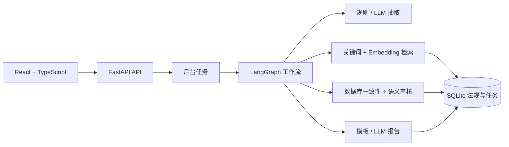
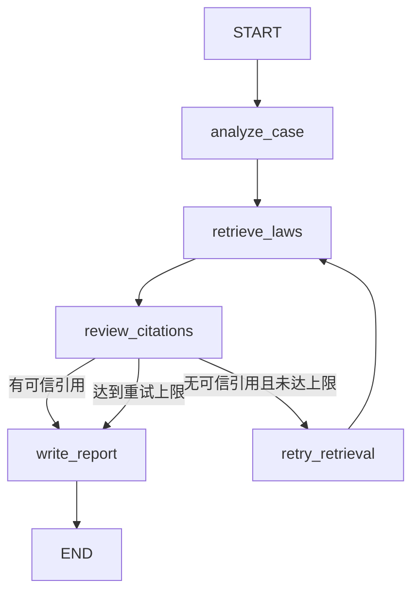

# 律镜 Legal Copilot Agent

[](https://github.com/Fyao21/LegalCopilot-Agent/actions/workflows/ci.yml)

一个可追溯、可评测、可离线降级的法律分析 Agent：输入合同或劳动争议材料，系统通过 LangGraph 提取案件要素、检索法规、审核引用并生成 Markdown/PDF 报告。

> 本项目用于软件工程与 AI 技术演示，不构成法律意见；内置法规是教学样例，正式使用前必须核对权威来源。

## 演示

浏览器页面支持问题输入、TXT/DOCX/PDF 上传、离线/Agent 模式、后台进度、执行引擎标识、引用回查和报告下载。

当前仓库提供[三分钟演示脚本](docs/DEMO_SCRIPT.md)。录制视频或 GIF 时不得出现 `.env`、API Key 和个人材料；完成录制后可把链接补充在这里。

## 核心能力

- LangGraph 编排案件抽取、混合检索、引用审核、补充检索和报告生成；
- 每条引用关联数据库 `article_id`，服务端核验名称、条号和原文；
- Agent 模式支持 OpenAI 兼容 Chat API，失败时安全降级到规则与模板；
- 页面明确显示 `智能 Agent`、`离线规则` 或 `Agent 已降级`，避免把降级结果误认为模型结果；
- FastAPI 后台任务、状态轮询、Markdown/PDF 导出和结构化请求日志；
- 上传大小、扩展名、MIME、空文件、解析超时和文件名安全校验；
- 24 条脱敏评测集，输出案件抽取、Recall@5、MRR、Hit@K、延迟和工作流指标；
- Ruff、mypy、32 项测试、前端生产构建与 GitHub Actions CI；
- SQLite 零依赖启动，同时保留 Docker Compose 与生产数据库迁移路径。

## 架构



## Agent 工作流



## 技术栈

- 后端：Python 3.11+、FastAPI、Pydantic、SQLAlchemy、LangGraph；
- 检索：中文二元词哈希向量、关键词/语义加权、可选 OpenAI 兼容 Embedding；
- 前端：React、TypeScript、Vite、ReactMarkdown；
- 数据：SQLite、JSONL 教学法规与评测集；
- 工程：unittest、Ruff、mypy、GitHub Actions、Docker Compose、Nginx。

## 快速启动

### 1. 后端

```powershell
python -m venv .venv
.\.venv\Scripts\Activate.ps1
python -m pip install -r requirements.txt
python -m app.main
```

浏览器打开 `http://127.0.0.1:8000/docs`。

PyCharm 运行配置：Module name 为 `app.main`，Working directory 为项目根目录，解释器选择 `.venv\Scripts\python.exe`。

### 2. 前端

```powershell
cd frontend
pnpm install
pnpm run dev
```

浏览器打开 `http://127.0.0.1:5173`。项目使用 pnpm 11 的 `allowBuilds`，只允许 esbuild 的必要安装脚本。

### 3. Docker（可选）

安装 Docker Desktop 后执行：

```powershell
docker compose up --build
```

前端地址为 `http://127.0.0.1:3000`，Swagger 为 `http://127.0.0.1:8000/docs`。当前开发机未安装 Docker，因此仓库不声称镜像已完成本机实测。

## 配置

复制 `.env.example` 为 `.env`。离线演示保持：

```env
OFFLINE_MODE=true
EMBEDDING_PROVIDER=hash
```

启用 Chat Agent：

```env
OFFLINE_MODE=false
LLM_API_KEY=你的新密钥
LLM_BASE_URL=https://api.deepseek.com
LLM_MODEL=服务商实际支持的模型名
```

Chat 与 Embedding 独立配置。仅有 DeepSeek Chat Key 不代表存在 Embedding API。完整说明见[配置文档](docs/CONFIGURATION.md)。`.env` 已被 Git 忽略，不要把真实密钥写进 README、截图、测试或 CI。

## API 示例

创建离线任务：

```powershell
curl.exe -X POST "http://127.0.0.1:8000/api/v1/runs" `
  -F "question=公司拖欠三个月工资，并且没有签订书面劳动合同" `
  -F "mode=offline"
```

响应：

```json
{
  "run_id": 1,
  "status": "queued",
  "status_url": "/api/v1/runs/1",
  "report_url": "/api/v1/runs/1/report"
}
```

查询 `/api/v1/runs/1` 可看到 `execution_engine=rules|llm|fallback` 和实际 `model`。完整接口见[逐接口文档](docs/API_GUIDE_DETAILED.md)与[Apifox OpenAPI](docs/openapi.json)。

## 评测

运行完全离线、可复现的评测：

```powershell
python eval\run_eval.py
```

当前 24 条脱敏教学样例结果：

| 指标/方案 | 结果 |
|---|---:|
| 案件类型准确率 | 100.00% |
| 关键事实关键词覆盖率 | 93.75% |
| 离线工作流成功率 | 100.00% |
| 关键词 Recall@5 / MRR | 1.0000 / 0.8000 |
| 哈希语义 Recall@5 / MRR | 0.8403 / 0.7118 |
| 哈希混合 Recall@5 / MRR | 0.8264 / 0.7361 |

首次规则基线的案件类型准确率为 75%，补充“供应商、交付、入职、经济补偿”等领域词后提升到 100%。这组指标只说明当前小型教学集；关键词方案在 10 条法规上优于哈希向量，不能推导真实 Embedding 一定更好。在线 Embedding 未配置，结果明确标记为 `skipped`，不编造第三方模型指标。机器可读结果见[latest.json](eval/results/latest.json)。

## 测试与代码质量

```powershell
python -m pip install -r requirements-dev.txt
ruff format --check app eval scripts tests
ruff check app eval scripts tests
mypy app/services app/llm eval
python scripts\run_self_test.py
cd frontend
pnpm run build
```

测试入口会强制设置离线模式并移除模型 Key，不会调用真实 DeepSeek。覆盖正常 API、损坏文件、超大文件、MIME 伪装、恶意文件名、提示/SQL 注入文本、模型超时、非法 JSON、重复提交和 SQLite 锁重试。

## 项目结构

```text
app/                 FastAPI、数据库、服务和 LangGraph
frontend/            React + TypeScript 页面
data/                教学法规 JSONL（运行数据库不提交）
eval/                脱敏评测集、指标代码和结果
tests/               单元、集成、安全与端到端测试
docs/decisions/      技术决策记录
.github/workflows/   GitHub Actions CI
```

## 当前限制

- 只有 10 条教学法规，不是全量、权威或自动更新的法规库；
- 评测集由项目作者构造，只有 24 条，存在规模和标注者偏差；
- 信息抽取覆盖率采用关键词近似，不等同于法律专家语义评分；
- 未配置独立在线 Embedding，真实向量对照组尚未运行；
- BackgroundTasks 与 Web 进程同生命周期，不具备任务持久恢复能力；
- SQLite 不适合多实例高并发写入，Docker 尚待安装后的真实验收；
- 不支持 OCR、账号权限、多租户、法规版本同步和真实法律意见。

## 后续方向

1. 双人复核并扩充评测集，接入独立 Embedding 后完成真实向量对照；
2. 使用 PostgreSQL/pgvector、Alembic、对象存储和持久任务队列；
3. 增加登录、租户隔离、审计、限流、监控与法规版本管理；
4. 录制三分钟演示视频并在 README 中加入 GIF。

更多资料：[产品说明](PRODUCT_SPEC.md) · [项目目标](PROJECT_GOALS.md) · [自测手册](SELF_TEST.md) · [学习日志](docs/LEARNING_JOURNAL.md) · [技术决策](docs/decisions/README.md) · [求职材料](docs/JOB_MATERIALS.md)
