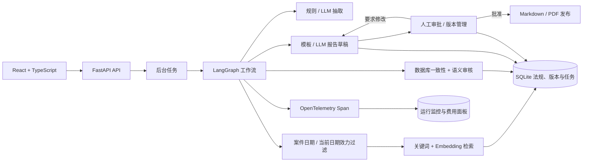
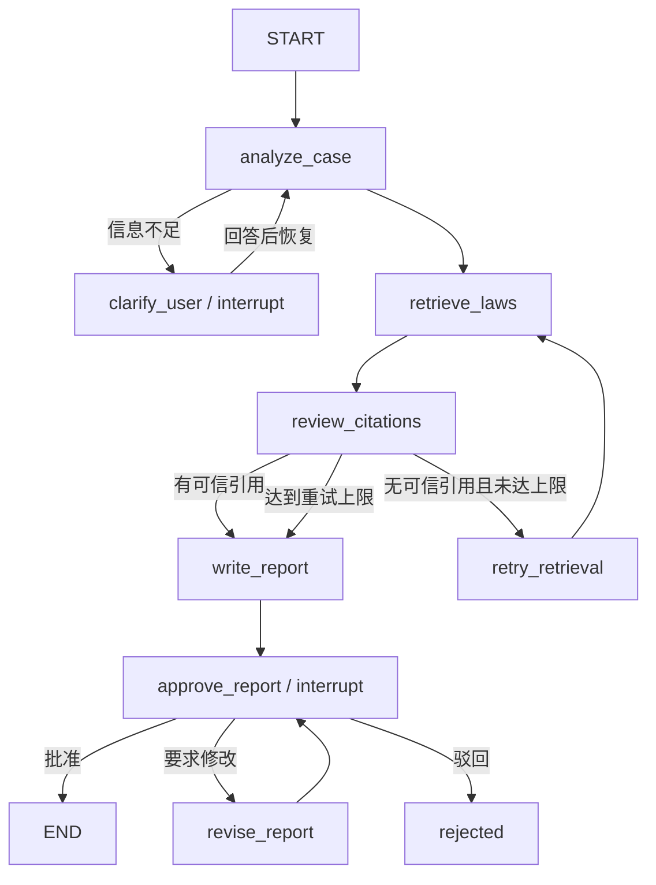

# 律镜 Legal Copilot Agent

[](https://github.com/Fyao21/LegalCopilot-Agent/actions/workflows/ci.yml)

一个可追溯、可评测、可离线降级的法律分析 Agent：输入案件问题或材料，系统通过 LangGraph 提取案件要素、检索法规、审核引用并生成报告草稿，经过人工审批后再发布 Markdown/PDF 最终报告。

> 本项目用于软件工程与 AI 技术演示，不构成法律意见；内置法规是教学样例，正式使用前必须核对权威来源。

## 演示

浏览器页面支持问题输入、案件发生日期、随机案件示例、TXT/DOCX/PDF 上传、离线/Agent 模式、后台进度、执行引擎标识、法规版本与效力标签、引用回查、多轮追问、报告审批、版本差异、批准后下载、运行监控，以及单条法规录入和最多 200 个 TXT 批量导入。

当前仓库提供[三分钟演示脚本](docs/DEMO_SCRIPT.md)。录制视频或 GIF 时不得出现 `.env`、API Key 和个人材料；完成录制后可把链接补充在这里。

## 核心能力

- LangGraph 编排案件抽取、混合检索、引用审核、补充检索和报告生成；
- 每条引用关联数据库 `article_id`，服务端核验名称、条号和原文；
- Agent 模式支持 OpenAI 兼容 Chat API，失败时安全降级到规则与模板；
- 页面明确显示 `智能 Agent`、`离线规则` 或 `Agent 已降级`，避免把降级结果误认为模型结果；
- 关键信息不足时进入多轮追问，回答持久化后从同一 LangGraph checkpoint 恢复，最多三轮；
- 前端显示追问卡片并通过 `sessionStorage` 恢复当前任务，回答后继续生成报告草稿；
- 报告生成后进入持久化人工审批，可批准、要求修改或驳回；修改创建新版本，历史草稿和意见不会覆盖；
- 最终导出只读取已批准版本，两个页面并发审批由 `state_version` 乐观锁保证只有一个成功；
- 法规实体与版本分表保存，检索在召回前按案件日期过滤；引用和报告同时保存 `law_version_id`、版本标签、效力状态与适用区间；
- OpenTelemetry 串联 API 与 LangGraph 节点，SQLite 保存脱敏 Span；监控页按 Trace ID 展示平均/P95 耗时、模型、Token、估算费用、重试和降级原因；
- 同一解除合同问题选择 2020-12-31 时返回《合同法》第九十四条历史版本，选择 2021-01-01 或留空时返回现行《民法典》第五百六十三条；
- 随机案件示例接口支持数量、分类和简短/详细程度筛选，详细案情包含背景、证据与诉求，首页可以点击“换一批”；
- FastAPI 后台任务、状态轮询、Markdown/PDF 导出和结构化请求日志；
- 上传大小、扩展名、MIME、空文件、解析超时和文件名安全校验；
- 单条法规写入、重复校验、增量种子导入与即时向量索引；
- 知识库管理页面支持手工录入、四行格式 TXT 批量导入，以及用 LLM 将任意排版的单条法规 TXT 整理成可下载、可核对的标准四行草稿；
- 提供从 10 个可核验官方页面生成的 200 个跨领域法规 TXT 和来源清单；
- 36 条合同、劳动和消费者权益教学法规，来源指向国家法律法规数据库或中国人大网；
- 24 条脱敏评测集，输出案件抽取、Recall@5、MRR、Hit@K、延迟和工作流指标；
- Ruff、mypy、84 项测试、前端生产构建与 GitHub Actions CI；
- SQLite 零依赖启动，同时保留 Docker Compose 与生产数据库迁移路径。

## 重点工程挑战

> **求职面试建议重点讲：多层 AI 故障不能只用一个“模型失败”概括。**

项目曾在同一次 Agent 运行中同时出现 LLM 返回“未识别”、在线 Embedding 瞬时超时后静默使用 hash、报告数组字段类型错误导致模板回退。修复时先通过持久化节点轨迹拆分根因，再分别加入 LLM 与确定性分类融合、在线向量有界重试和可见回退原因、结构化输出 Schema 修复与安全归一化。真实配置回归最终使用 `deepseek-v4-flash + text-embedding-v4` 完成食品安全问题分析，没有离线回退。

这项挑战体现的不是“又写了几个 if”，而是 Agent 系统的可观测性、分层容错、结果可信度和降级透明性。完整复盘见[学习文档：Agent 联合故障修复](docs/LEARNING_JOURNAL.md#2026-07-26agent未识别hash离线回退联合故障修复)，面试表达见[求职材料](docs/JOB_MATERIALS.md#重点项目挑战多层智能回退与可观测性)。

## 架构


```mermaid
flowchart LR
    UI["React + TypeScript"] --> API["FastAPI API"]
    API --> TASK["后台任务"]
    TASK --> GRAPH["LangGraph 工作流"]
    GRAPH --> ANALYZE["规则 / LLM 抽取"]
    GRAPH --> TIME["案件日期 / 当前日期效力过滤"]
    TIME --> RETRIEVE["关键词 + Embedding 检索"]
    GRAPH --> REVIEW["数据库一致性 + 语义审核"]
    GRAPH --> REPORT["模板 / LLM 报告草稿"]
    REPORT --> APPROVAL["人工审批 / 版本管理"]
    APPROVAL -->|"要求修改"| REPORT
    APPROVAL -->|"批准"| EXPORT["Markdown / PDF 发布"]
    RETRIEVE --> DB[("SQLite 法规、版本与任务")]
    REVIEW --> DB
    REPORT --> DB
    APPROVAL --> DB
    GRAPH --> TRACE["OpenTelemetry Span"]
    TRACE --> OBS[("运行监控与费用面板")]
```

## Agent 工作流


```mermaid
flowchart TD
    START --> A["analyze_case"]
    A -->|"信息不足"| C["clarify_user / interrupt"]
    C -->|"回答后恢复"| A
    A --> R["retrieve_laws"]
    R --> V["review_citations"]
    V -->|"有可信引用"| W["write_report"]
    V -->|"无可信引用且未达上限"| X["retry_retrieval"]
    X --> R
    V -->|"达到重试上限"| W
    W --> P["approve_report / interrupt"]
    P -->|"批准"| END
    P -->|"要求修改"| M["revise_report"]
    M --> P
    P -->|"驳回"| REJECTED["rejected"]
```

## 技术栈

- 后端：Python 3.11+、FastAPI、Pydantic、SQLAlchemy、LangGraph；
- 检索：中文二元词哈希向量、关键词/语义加权、可选 OpenAI 兼容 Embedding；
- 前端：React、TypeScript、Vite、ReactMarkdown；
- 数据：SQLite、JSONL 教学法规与评测集；
- 工程：unittest、Ruff、mypy、OpenTelemetry、GitHub Actions、Docker Compose、Nginx。

## 快速启动

### 1. 后端

```powershell
python -m venv .venv
.\.venv\Scripts\Activate.ps1
python -m pip install -r requirements.txt
python -m app.main
```

浏览器打开 `http://127.0.0.1:8000/docs`。

PyCharm 运行配置：Module name 为 `app.main`，Working directory 为项目根目录，解释器选择 `.venv\Scripts\python.exe`。

### 2. 前端

```powershell
cd frontend
pnpm install
pnpm run dev
```

浏览器打开 `http://127.0.0.1:5173`。项目使用 pnpm 11 的 `allowBuilds`，只允许 esbuild 的必要安装脚本。

### 3. Docker（可选）

安装 Docker Desktop 后执行：

```powershell
docker compose up --build
```

前端地址为 `http://127.0.0.1:3000`，Swagger 为 `http://127.0.0.1:8000/docs`。当前开发机未安装 Docker，因此仓库不声称镜像已完成本机实测。

## 配置

复制 `.env.example` 为 `.env`。离线演示保持：

```env
OFFLINE_MODE=true
EMBEDDING_PROVIDER=hash
```

启用 Chat Agent：

```env
OFFLINE_MODE=false
LLM_API_KEY=你的新密钥
LLM_BASE_URL=https://api.deepseek.com
LLM_MODEL=服务商实际支持的模型名
```

Chat 与 Embedding 独立配置。仅有 DeepSeek Chat Key 不代表存在 Embedding API。完整说明见[配置文档](docs/CONFIGURATION.md)。`.env` 已被 Git 忽略，不要把真实密钥写进 README、截图、测试或 CI。

启用独立的 OpenAI 兼容 Embedding，例如阿里云百炼：

```env
OFFLINE_MODE=false
EMBEDDING_PROVIDER=openai-compatible
EMBEDDING_API_KEY=你的Embedding密钥
EMBEDDING_BASE_URL=https://你的WorkspaceId.cn-beijing.maas.aliyuncs.com/compatible-mode/v1
EMBEDDING_MODEL=text-embedding-v4
EMBEDDING_BATCH_SIZE=10
```

先执行 `python scripts\check_embedding.py` 验证一条短文本，再执行 `python scripts\reindex_embeddings.py` 建立在线索引。搜索响应头 `X-Embedding-Provider` 和 `X-Embedding-Model` 会显示本次实际使用的服务；在线失败时明确降级为 `hash`。

## API 示例

创建离线任务：

```powershell
curl.exe -X POST "http://127.0.0.1:8000/api/v1/runs" `
  -F "question=公司拖欠三个月工资，并且没有签订书面劳动合同" `
  -F "as_of_date=2020-12-31" `
  -F "mode=offline"
```

响应：

```json
{
  "run_id": 1,
  "status": "queued",
  "as_of_date": "2020-12-31",
  "trace_id": "fb8cd20bddf7466a8a85b9df19a3725f",
  "status_url": "/api/v1/runs/1",
  "report_url": "/api/v1/runs/1/report",
  "monitoring_url": "/api/v1/runs/1/monitoring"
}
```

查询 `/api/v1/runs/1` 可看到 `execution_engine=rules|llm|fallback` 和实际 `model`。完整接口见[逐接口文档](docs/API_GUIDE_DETAILED.md)与[Apifox OpenAPI](docs/openapi.json)。

查询 `/api/v1/runs/1/monitoring` 可定位单次 Trace；查询 `/api/v1/monitoring/overview?days=7` 可查看运行数、成功率、降级率、平均/P95 耗时、Token 与费用汇总。费用统一以人民币估算，单价默认是 0，需在 `.env` 按模型服务商实际价格配置。

如果任务返回 `waiting_for_user`，先查询并回答追问：

```powershell
GET  /api/v1/runs/{run_id}/pending-action
POST /api/v1/runs/{run_id}/clarifications
```

提交回答必须携带 `Idempotency-Key`，请求体使用待办响应中的 `state_version` 和 `question_id`。回答受理后仍使用原 `run_id`，工作流从 SQLite checkpoint 恢复并继续生成报告。

新增一条经过核验的法规：

```powershell
curl.exe -X POST "http://127.0.0.1:8000/api/v1/knowledge/articles" `
  -H "Content-Type: application/json" `
  -d '{"law_name":"中华人民共和国民法典","article_number":"第五百八十条","content":"经过人工核验的条文内容","source":"国家法律法规数据库；访问日期：2026-07-23"}'
```

相同法律名称和条文编号重复提交时返回 409；创建成功后可以立即通过法规搜索接口检索。

整理一份排版不固定的法规 TXT：

```powershell
curl.exe -X POST "http://127.0.0.1:8000/api/v1/knowledge/articles/normalize" `
  -F "file=@examples\unstructured_law_example.txt;type=text/plain"
```

该接口需要在线 Chat LLM，只生成标准四行 TXT 草稿，不会直接写数据库。`ready_for_import=false` 表示存在缺失字段或识别到多条法规；即使为 `true` 也要人工核对原文与来源。

## 评测

运行完全离线、可复现的评测：

```powershell
python eval\run_eval.py
```

当前 24 条脱敏教学样例结果：

| 指标/方案 | 结果 |
|---|---:|
| 案件类型准确率 | 100.00% |
| 关键事实关键词覆盖率 | 93.75% |
| 离线工作流成功率 | 100.00% |
| 关键词 Recall@5 / MRR | 0.7639 / 0.6736 |
| 哈希语义 Recall@5 / MRR | 0.6458 / 0.4875 |
| 哈希混合 Recall@5 / MRR | 0.6806 / 0.5708 |

首次规则基线的案件类型准确率为 75%，补充“供应商、交付、入职、经济补偿”等领域词后提升到 100%。法规从 10 条扩充到 36 条后，检索任务更难，三组 Recall@5 均下降，说明扩大语料后必须同步维护标注、分词和检索策略。这组指标只说明当前小型教学集，不能外推真实法律服务或真实 Embedding 的效果。在线 Embedding 未配置，结果明确标记为 `skipped`，不编造第三方模型指标。机器可读结果见[latest.json](eval/results/latest.json)。

## 测试与代码质量

```powershell
python -m pip install -r requirements-dev.txt
ruff format --check app eval scripts tests
ruff check app eval scripts tests
mypy app/services app/llm eval
python scripts\run_self_test.py
cd frontend
pnpm run build
```

测试入口会强制设置离线模式并移除模型 Key，不会调用真实 DeepSeek。84 项测试覆盖正常 API、损坏文件、超大文件、MIME 伪装、恶意文件名、提示/SQL 注入文本、模型超时、非法 JSON、重复提交、SQLite 锁重试、法规日期边界、废止版本排除、报告版本引用持久化、带日期引用的模型报告生成，以及 Trace、Span、监控聚合、Token/人民币费用和遥测隐私白名单。

## 项目结构

```text
app/                 FastAPI、数据库、服务和 LangGraph
frontend/            React + TypeScript 页面
data/                教学法规 JSONL（运行数据库不提交）
eval/                脱敏评测集、指标代码和结果
tests/               单元、集成、安全与端到端测试
docs/decisions/      技术决策记录
.github/workflows/   GitHub Actions CI
```

## 当前限制

- 只有 36 条内置教学法规和一组人工维护的版本演示数据，仍不是全量或自动更新的生产法规库；
- 评测集由项目作者构造，只有 24 条，存在规模和标注者偏差；
- 信息抽取覆盖率采用关键词近似，不等同于法律专家语义评分；
- 未配置独立在线 Embedding，真实向量对照组尚未运行；
- BackgroundTasks 与 Web 进程同生命周期，不具备任务持久恢复能力；
- 当前遥测保存在本地 SQLite，尚未配置 OTLP Collector、指标告警和生产级保留策略；
- SQLite 不适合多实例高并发写入，Docker 尚待安装后的真实验收；
- 不支持 OCR、账号权限、多租户、法规自动同步、来源定期复核和真实法律意见。

## 后续方向

1. 双人复核并扩充评测集，接入独立 Embedding 后完成真实向量对照；
2. 使用 PostgreSQL/pgvector、Alembic、对象存储和持久任务队列；
3. 增加登录、租户隔离、审计、限流、OTLP 指标告警与法规来源自动同步；
4. 录制三分钟演示视频并在 README 中加入 GIF。

详细的第 5～12 周优化路线已经拆解为状态机、数据模型、接口草案、前端任务、测试标准和面试问题，见[未来优化实施计划](docs/FUTURE_OPTIMIZATION_PLAN.md)。路线采用“每周一个独立可用功能”的纵向切片：第五周交付可恢复追问，第六周增加报告审批，第七周增加按案件日期检索法规版本，第八周增加 Agent Trace 与费用面板；持久队列、RBAC、安全评测和 MCP 继续分别在后续周独立完成。

更多资料：[学习顺序与执行计划](docs/STUDY_PLAN.md) · [产品说明](PRODUCT_SPEC.md) · [项目目标](PROJECT_GOALS.md) · [自测手册](SELF_TEST.md) · [学习日志](docs/LEARNING_JOURNAL.md) · [技术决策](docs/decisions/README.md) · [求职材料](docs/JOB_MATERIALS.md) · [Agent 面经与项目化回答](docs/AGENT_INTERVIEW_GUIDE.md)
