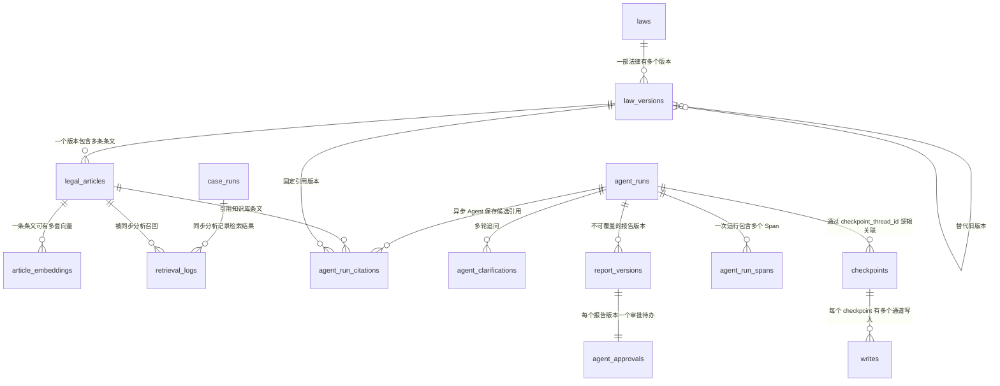

# LegalCopilot-Agent 数据库学习文档

> 数据库：SQLite
>
> 默认文件：`data/legal_copilot.db`
>
> 本次结构与数量核对日期：2026-08-01

本文档用于学习项目的数据模型，说明：

1. 每个数据文件是什么；
2. 当前有哪些表；
3. 每张表的每个字段是什么意思；
4. 表之间如何关联；
5. 为什么部分表会有上千行数据；
6. 在 PyCharm 中应该如何检查。

数据库中的行数会随着案件提交、法规导入、自动测试、追问、审批和工作流恢复不断变化。本文记录的数量是一次本机快照，不是固定业务指标。

---

# 一、先认识三个数据文件

| 文件 | 作用 | 是否提交 GitHub |
|---|---|---|
| `data/legal_copilot.db` | 本地开发、网页操作和 Agent 运行使用的正式演示库 | 不提交 |
| `data/test_legal_copilot.db` | 统一自测脚本使用的测试库，可以重新生成 | 不提交 |
| `data/sample_laws.jsonl` | 36 条内置教学法规的初始化源文件，不是数据库 | 可以提交 |

## 1. `legal_copilot.db`

这个文件保存网页操作产生的真实本地数据，包括：

- 用户提交的案件问题和材料解析文本；
- 案件要素、Agent 状态和报告；
- 法律、法规版本和具体条文；
- Hash/在线 Embedding 向量；
- 每次检索选中的候选条文；
- 多轮追问和人工审批；
- OpenTelemetry Trace 与节点 Span；
- LangGraph 中断恢复所需的 checkpoint。

它可能包含案件问题、材料文本、审批意见和报告，因此禁止上传 GitHub。

## 2. `test_legal_copilot.db`

推荐通过以下统一入口运行测试：

```powershell
python scripts/run_self_test.py
```

该脚本会提前设置测试数据库、离线模式和 Hash Embedding，避免调用真实模型，也避免污染正式演示库。

如果直接执行：

```powershell
python -m pytest
```

但没有在导入应用前正确覆盖 `DATABASE_URL`，测试可能使用 `.env` 指向的正式库。开发时优先使用统一自测脚本。

## 3. `sample_laws.jsonl`

JSONL 表示“一行一个 JSON 对象”，例如：

```json
{"law_name":"中华人民共和国劳动合同法","article_number":"第十条","content":"建立劳动关系，应当订立书面劳动合同。","source":"sample"}
```

它用于初始化教学知识库。项目运行后，实际业务查询读取的是 SQLite 表，而不是每次直接扫描 JSONL。

---

# 二、数据库整体关系



需要特别区分两条历史数据链：

```text
第一、二周同步接口：
case_runs → retrieval_logs

第三周以后异步 Agent：
agent_runs
  ├─ agent_run_citations
  ├─ agent_clarifications
  ├─ report_versions → agent_approvals
  ├─ agent_run_spans
  └─ checkpoints → writes
```

`case_runs` 和 `agent_runs` 不是重复表。前者保留早期同步接口数据，后者承载当前完整 Agent 工作流。

---

# 三、当前数据库数量快照

当前 `legal_copilot.db` 实际包含 14 张项目/运行时表：

| 表名 | 当前行数 | 为什么会增长 |
|---|---:|---|
| `laws` | 36 | 每部法律一行 |
| `law_versions` | 36 | 每个法规版本一行 |
| `legal_articles` | 256 | 内置数据和批量导入的法律条文 |
| `article_embeddings` | 512 | 256 条文 × 2 套 provider/model |
| `case_runs` | 17 | 早期同步案件分析 |
| `retrieval_logs` | 85 | 17 次同步分析 × Top-5 |
| `agent_runs` | 287 | 每次异步 Agent 提交一行 |
| `agent_run_citations` | 1180 | 236 次完成检索的运行 × Top-5 |
| `agent_clarifications` | 78 | 每轮追问一行 |
| `report_versions` | 180 | 每个报告版本一行 |
| `agent_approvals` | 180 | 每个报告版本对应一个审批待办 |
| `agent_run_spans` | 1164 | 每个工作流节点/模型调用一个 Span |
| `checkpoints` | 1501 | LangGraph 每个状态快照一行 |
| `writes` | 8351 | LangGraph 每个 checkpoint 的通道写入 |

`sqlite_master` 是 SQLite 自带的系统目录，用于保存表、索引等定义，不是项目业务表。

---

# 四、知识库与法规版本表

## 4.1 `laws`：法律主表

一行表示“一部法律”，不表示某个具体版本。

| 字段 | 类型/约束 | 含义 |
|---|---|---|
| `id` | INTEGER，主键 | 法律内部 ID |
| `name` | VARCHAR(200)，唯一 | 法律名称，例如《中华人民共和国民法典》 |
| `jurisdiction` | VARCHAR(100) | 适用法域，默认“中华人民共和国” |
| `created_at` | DATETIME | 法律主记录创建时间 |

为什么需要单独的 `laws`：同一部法律未来可能有多个修订版本，法律身份不应和某一次版本混在一起。

## 4.2 `law_versions`：法规版本表

一行表示一部法律的一个版本或一个历史有效阶段。

| 字段 | 类型/约束 | 含义 |
|---|---|---|
| `id` | INTEGER，主键 | 法规版本 ID |
| `law_id` | INTEGER，外键 → `laws.id` | 这个版本属于哪部法律 |
| `version_label` | VARCHAR(100) | 版本名称，例如“2021-01-01 生效版本” |
| `effective_from` | DATE | 开始生效日期 |
| `effective_to` | DATE，可空 | 失效日期；空表示尚未设置结束日期 |
| `status` | VARCHAR(32) | `effective`、`amended`、`repealed` 等效力状态 |
| `source` | VARCHAR(500) | 版本信息来源 |
| `supersedes_version_id` | INTEGER，可空，自外键 | 当前版本替代的旧版本 ID |
| `created_at` | DATETIME | 版本记录创建时间 |

有效期采用左闭右开区间：

```text
[effective_from, effective_to)
```

例如 `effective_to=2021-01-01`，表示该旧版本在 2021-01-01 当天不再适用。

唯一约束：

```text
(law_id, version_label)
```

同一部法律不能重复创建同名版本。

## 4.3 `legal_articles`：法律条文表

一行表示一条可以被检索、引用和审核的具体法律条文。

| 字段 | 类型/约束 | 含义 |
|---|---|---|
| `id` | INTEGER，主键 | 条文 ID，也是报告引用中的 `article_id` |
| `law_name` | VARCHAR(200) | 冗余保存法律名称，便于展示和搜索 |
| `article_number` | VARCHAR(64) | 条号，例如“第十条” |
| `content` | TEXT | 条文正文 |
| `source` | VARCHAR(500) | 条文来源 |
| `embedding` | JSON | 早期版本保留的 Hash 向量兼容字段 |
| `law_version_id` | INTEGER，可空，外键 → `law_versions.id` | 条文属于哪个精确法规版本 |

当前混合检索主要读取 `article_embeddings`，`embedding` 是第一、二周遗留兼容字段，不应把它和当前多 provider 向量表混淆。

## 4.4 `article_embeddings`：条文向量表

一行表示“一条法律条文在某个 provider/model 下的一套向量”。

| 字段 | 类型/约束 | 含义 |
|---|---|---|
| `id` | INTEGER，主键 | 向量记录 ID |
| `article_id` | INTEGER，外键 → `legal_articles.id` | 对应哪条法律条文 |
| `provider` | VARCHAR(64) | 向量服务，例如 `hash`、`openai-compatible` |
| `model` | VARCHAR(200) | 模型名称，例如 `text-embedding-v4` |
| `dimensions` | INTEGER | 向量维度 |
| `content_hash` | VARCHAR(64) | 条文正文 SHA-256，用于判断正文是否改变 |
| `vector` | JSON | 实际浮点向量数组 |
| `created_at` | DATETIME | 向量创建或首次写入时间 |

唯一约束：

```text
(article_id, provider, model)
```

因此同一条文可以同时保存多套向量，不会互相覆盖。

当前 512 行的构成：

| Provider | Model | 维度 | 行数 |
|---|---|---:|---:|
| `hash` | `chinese-bigram-sha256-v1` | 384 | 256 |
| `openai-compatible` | `text-embedding-v4` | 1024 | 256 |

这不是重复数据，而是 256 条法规分别建立了离线 Hash 和阿里云百炼在线 Embedding 两套索引。

---

# 五、早期同步分析表

## 5.1 `case_runs`：同步案件分析记录

这是第一、二周同步接口使用的运行表。

| 字段 | 类型/约束 | 含义 |
|---|---|---|
| `id` | INTEGER，主键 | 同步案件运行 ID |
| `filename` | VARCHAR(500)，可空 | 上传文件名 |
| `question` | TEXT | 用户案件问题 |
| `extracted_text` | TEXT | 从 TXT/DOCX/PDF 提取的文本 |
| `case_type` | VARCHAR(100) | 识别出的案件类型 |
| `as_of_date` | DATE，可空 | 法规检索适用日期 |
| `created_at` | DATETIME | 创建时间 |

## 5.2 `retrieval_logs`：同步检索结果

一行表示一次同步案件分析召回的一条候选法条。

| 字段 | 类型/约束 | 含义 |
|---|---|---|
| `id` | INTEGER，主键 | 检索日志 ID |
| `case_run_id` | INTEGER，外键 → `case_runs.id` | 属于哪次同步分析 |
| `article_id` | INTEGER，外键 → `legal_articles.id` | 召回的条文 |
| `law_version_id` | INTEGER，可空，外键 → `law_versions.id` | 本次适用的法规版本 |
| `score` | FLOAT | 检索综合分数 |

当前有 17 次同步分析，每次保存 Top-5，所以：

```text
17 × 5 = 85 行
```

---

# 六、Agent 运行主表

## 6.1 `agent_runs`：异步 Agent 任务

这是当前最核心的任务主表。一行表示用户提交的一次完整 Agent 运行。

### 输入和基础身份

| 字段 | 类型/约束 | 含义 |
|---|---|---|
| `id` | INTEGER，主键 | `run_id`，所有 Agent 子表都通过它关联 |
| `filename` | VARCHAR(500)，可空 | 上传材料的原始文件名 |
| `question` | TEXT | 用户输入的案件问题 |
| `extracted_text` | TEXT | 上传材料解析后的正文 |
| `mode` | VARCHAR(32) | `offline` 或 `agent` |
| `as_of_date` | DATE，可空 | 按哪个日期筛选有效法规 |

### 工作流状态

| 字段 | 类型/约束 | 含义 |
|---|---|---|
| `status` | VARCHAR(32) | 当前任务状态 |
| `current_node` | VARCHAR(64)，可空 | 当前 LangGraph 节点 |
| `progress` | INTEGER | 前端显示的 0～100 进度 |
| `retry_count` | INTEGER | 补充检索等工作流重试次数 |
| `clarification_round` | INTEGER | 已进入第几轮用户追问 |
| `state_version` | INTEGER | 乐观锁版本号，防止并发重复回答/审批 |
| `checkpoint_thread_id` | VARCHAR(100)，唯一、可空 | LangGraph checkpoint 线程 ID |

常见 `status`：

| 状态 | 含义 |
|---|---|
| `queued` | 已创建，等待执行 |
| `analyzing` | 提取案件要素 |
| `waiting_for_user` | 缺少关键信息，等待用户回答 |
| `resuming` | 收到回答后恢复 |
| `retrieving` | 检索法规 |
| `reviewing` | 审核引用 |
| `writing` | 生成报告 |
| `waiting_for_approval` | 等待人工审批 |
| `revising` | 根据审批意见修订 |
| `completed` | 已批准并完成 |
| `rejected` | 报告被驳回 |
| `failed` | 系统执行失败 |

### 抽取和报告快捷字段

| 字段 | 类型/约束 | 含义 |
|---|---|---|
| `facts` | JSON，可空 | 案件类型、当事人、关键事实、诉求、争议焦点等 |
| `report_title` | VARCHAR(300)，可空 | 当前报告标题 |
| `report_markdown` | TEXT，可空 | 当前报告 Markdown 快捷副本 |
| `evidence_gaps` | JSON，可空 | 证据和信息缺口 |
| `node_traces` | JSON | 供执行轨迹界面使用的简化节点记录 |
| `model_name` | VARCHAR(200)，可空 | 实际报告模型或离线模板名称 |

`report_markdown` 方便快速读取当前报告；真正不可覆盖的历史版本保存在 `report_versions`。

### 报告版本和审批

| 字段 | 类型/约束 | 含义 |
|---|---|---|
| `current_report_version` | INTEGER | 当前最新报告版本号 |
| `approved_report_version` | INTEGER，可空 | 已批准的版本号；它是版本编号，不是外键 ID |

### 错误信息

| 字段 | 类型/约束 | 含义 |
|---|---|---|
| `error_code` | VARCHAR(100)，可空 | 稳定错误码 |
| `error_message` | TEXT，可空 | 面向用户或开发者的错误说明 |

### Trace、Token 和人民币费用

| 字段 | 类型/约束 | 含义 |
|---|---|---|
| `trace_id` | VARCHAR(32)，唯一、可空 | 关联 HTTP、LangGraph 节点和模型调用 |
| `total_duration_ms` | INTEGER | 多个根 `agent.invoke` Span 的累计耗时 |
| `input_tokens` | INTEGER | Chat 与 Embedding 输入 Token 合计 |
| `output_tokens` | INTEGER | Chat 输出 Token 合计 |
| `estimated_cost_cny` | FLOAT | 按人民币单价估算的总费用 |
| `estimated_cost_usd` | FLOAT，遗留 | 旧数据库兼容列，当前固定写 0，不再进入接口 |
| `fallback_count` | INTEGER | 模型或 Embedding 发生降级的次数 |

### 时间

| 字段 | 类型/约束 | 含义 |
|---|---|---|
| `created_at` | DATETIME | 任务创建时间 |
| `started_at` | DATETIME，可空 | 后台工作流开始时间 |
| `completed_at` | DATETIME，可空 | 任务完成、驳回或失败时间 |

当前 287 次运行中：

| 模式 | 数量 |
|---|---:|
| `offline` | 255 |
| `agent` | 32 |

2026-08-01 当天有 170 次运行，说明当前库包含大量开发回归和手工验收数据，不是 287 个真实用户。

---

# 七、Agent 检索与引用

## 7.1 `agent_run_citations`：每次运行的引用快照

一行表示“某次 Agent 运行选中的一条候选法律条文”。

| 字段 | 类型/约束 | 含义 |
|---|---|---|
| `id` | INTEGER，主键 | 引用记录 ID |
| `run_id` | INTEGER，外键 → `agent_runs.id` | 属于哪次 Agent 运行 |
| `article_id` | INTEGER，外键 → `legal_articles.id` | 引用了哪条知识库条文 |
| `law_version_id` | INTEGER，可空，外键 → `law_versions.id` | 引用的精确法规版本 |
| `score` | FLOAT | 混合检索综合分数 |
| `keyword_score` | FLOAT | 关键词匹配分数 |
| `semantic_score` | FLOAT | Embedding 余弦相似度分数 |
| `review_status` | VARCHAR(32) | `pending`、`verified`、`low_confidence`、`rejected` |
| `review_reason` | TEXT，可空 | 为什么通过、低置信或拒绝 |
| `verified` | BOOLEAN | 是否通过引用真实性和支撑关系审核 |

唯一约束：

```text
(run_id, article_id)
```

同一次运行不能重复保存同一条法条。

## 7.2 为什么有 1180 行？

当前数据计算结果：

```text
完成检索并保存引用的 Agent 运行：236 次
每次运行保存候选引用：5 条
236 × 5 = 1180 行
```

进一步检查：

| 项目 | 结果 |
|---|---:|
| 有引用的运行 | 236 |
| 每个有引用运行的最少引用数 | 5 |
| 每个有引用运行的最多引用数 | 5 |
| 平均引用数 | 5 |
| 同一 `run_id + article_id` 重复组 | 0 |
| `verified=true` | 1139 |
| `low_confidence` | 41 |

因此这 1180 行是正常的一对多业务数据，不是 1180 条法律，也不是同一条记录被无限重复写入。

没有引用的 51 次运行分别是：

| 状态 | 数量 | 原因 |
|---|---:|---|
| `waiting_for_user` | 22 | 还在追问阶段，没有进入检索 |
| `queued` | 19 | 尚未执行 |
| `failed` | 10 | 在保存引用前失败 |

这张表必须保留运行级快照。即使两次案件都引用同一条《民法典》条文，它们的检索分数、案件日期、审核结果和报告上下文也不同，不能合并成一行。

---

# 八、多轮追问、报告版本和人工审批

## 8.1 `agent_clarifications`：追问轮次

一行表示某次 Agent 运行的一轮追问。

| 字段 | 类型/约束 | 含义 |
|---|---|---|
| `id` | INTEGER，主键 | 追问记录 ID，也可作为待办 `action_id` |
| `run_id` | INTEGER，外键 → `agent_runs.id` | 属于哪次运行 |
| `round_number` | INTEGER | 第几轮追问 |
| `status` | VARCHAR(32) | `pending` 或 `answered` |
| `questions` | JSON | 本轮问题、问题 ID、缺失字段和必填标记 |
| `answers` | JSON，可空 | 用户提交的回答 |
| `idempotency_key` | VARCHAR(200)，可空 | 防止相同请求重复写入 |
| `requested_state_version` | INTEGER | 发起追问时的运行状态版本 |
| `answered_state_version` | INTEGER，可空 | 回答成功后的状态版本 |
| `created_at` | DATETIME | 追问创建时间 |
| `answered_at` | DATETIME，可空 | 用户回答时间 |

唯一约束：

```text
(run_id, round_number)
(run_id, idempotency_key)
```

当前 78 行中，56 轮已回答，22 轮仍在等待回答。

## 8.2 `report_versions`：不可覆盖的报告版本

一行表示报告的一个完整版本。

| 字段 | 类型/约束 | 含义 |
|---|---|---|
| `id` | INTEGER，主键 | 报告版本内部 ID |
| `run_id` | INTEGER，外键 → `agent_runs.id` | 属于哪次 Agent 运行 |
| `version_number` | INTEGER | 用户看到的 V1、V2、V3 |
| `title` | VARCHAR(300) | 该版本报告标题 |
| `markdown` | TEXT | 该版本完整 Markdown |
| `facts_snapshot` | JSON | 生成该版本时的案件事实快照 |
| `citations_snapshot` | JSON | 生成该版本时的引用快照 |
| `change_summary` | TEXT，可空 | 相对上一版本的修改摘要 |
| `status` | VARCHAR(32) | `draft`、`approved`、`superseded`、`rejected` |
| `created_at` | DATETIME | 版本创建时间 |
| `approved_at` | DATETIME，可空 | 审批通过时间 |

唯一约束：

```text
(run_id, version_number)
```

当前 180 个报告版本：

| 状态 | 数量 |
|---|---:|
| `approved` | 86 |
| `draft` | 76 |
| `rejected` | 9 |
| `superseded` | 9 |

## 8.3 `agent_approvals`：人工审批待办与决定

一行表示一个报告版本的一次审批待办。

| 字段 | 类型/约束 | 含义 |
|---|---|---|
| `id` | INTEGER，主键 | 审批待办 ID，也是前端判断新审批轮次的 `action_id` |
| `run_id` | INTEGER，外键 → `agent_runs.id` | 属于哪次运行 |
| `report_version_id` | INTEGER，外键 → `report_versions.id` | 审批哪个报告版本 |
| `round_number` | INTEGER | 第几轮审批 |
| `status` | VARCHAR(32) | `pending`、`approved`、`changes_requested`、`rejected` |
| `action` | VARCHAR(32)，可空 | `approve`、`request_changes`、`reject`；待决定时为空 |
| `comment` | TEXT，可空 | 审批意见 |
| `reviewer` | VARCHAR(100) | 审核人 |
| `idempotency_key` | VARCHAR(200)，可空 | 防止重复审批请求 |
| `requested_state_version` | INTEGER | 创建审批时的状态版本 |
| `decided_state_version` | INTEGER，可空 | 审批成功后的状态版本 |
| `created_at` | DATETIME | 审批待办创建时间 |
| `decided_at` | DATETIME，可空 | 做出决定的时间 |

唯一约束：

```text
(run_id, report_version_id)
(run_id, idempotency_key)
```

当前 180 条审批与 180 个报告版本一一对应：

| 审批状态/动作 | 数量 |
|---|---:|
| `pending` | 76 |
| `approved / approve` | 86 |
| `changes_requested / request_changes` | 9 |
| `rejected / reject` | 9 |

---

# 九、Agent 可观测性表

## 9.1 `agent_run_spans`：Trace 节点明细

一行表示一次可观测操作，例如一个工作流节点、一次 Chat 调用或一次 Embedding 调用。

| 字段 | 类型/约束 | 含义 |
|---|---|---|
| `id` | INTEGER，主键 | 本地 Span 记录 ID |
| `run_id` | INTEGER，外键 → `agent_runs.id` | 属于哪次 Agent 运行 |
| `trace_id` | VARCHAR(32) | 端到端 Trace ID |
| `span_id` | VARCHAR(16) | 当前 Span ID |
| `parent_span_id` | VARCHAR(16)，可空 | 父 Span ID，用于构建树 |
| `name` | VARCHAR(100) | `agent.invoke`、`gen_ai.chat`、`gen_ai.embeddings` 等 |
| `node` | VARCHAR(64)，可空 | 对应 LangGraph 节点 |
| `status` | VARCHAR(32) | `completed`、`failed` 等 |
| `duration_ms` | INTEGER | Span 耗时 |
| `provider` | VARCHAR(100)，可空 | `rules`、`hash`、`openai-compatible` 等 |
| `model` | VARCHAR(200)，可空 | 具体模型名称 |
| `input_tokens` | INTEGER | 输入 Token |
| `output_tokens` | INTEGER | 输出 Token |
| `estimated_cost_cny` | FLOAT | 当前 Span 人民币估算费用 |
| `estimated_cost_usd` | FLOAT，遗留 | 旧库兼容字段，固定写 0 |
| `retry_count` | INTEGER | 当前调用重试次数 |
| `fallback_reason` | VARCHAR(500)，可空 | 降级原因 |
| `error_code` | VARCHAR(100)，可空 | 错误码 |
| `attributes` | JSON | allowlist 过滤后的低敏遥测属性 |
| `started_at` | DATETIME | Span 开始时间 |
| `completed_at` | DATETIME | Span 结束时间 |

唯一约束：

```text
(run_id, span_id)
```

为什么有 1164 行：一次 Agent 运行不是只有一个 Span，而是可能包含：

```text
agent.invoke
  ├─ agent.analyze_case
  │   └─ gen_ai.chat
  ├─ agent.retrieval
  │   └─ gen_ai.embeddings
  ├─ agent.review_citations
  │   └─ gen_ai.chat
  ├─ agent.write_report
  │   └─ gen_ai.chat
  └─ agent.approval.resume
```

追问恢复、审批恢复和报告修订还会继续增加 Span，所以 Span 行数大于运行数是正常现象。

`attributes` 故意不保存案件全文、Prompt、API Key、身份证、地址或电话。

---

# 十、LangGraph 内部状态表

`checkpoints` 和 `writes` 由 `langgraph-checkpoint-sqlite` 管理，不是手工设计的业务表。它们支持：

- Agent 在缺少信息时中断；
- 用户回答后从原节点继续；
- 报告等待人工审批；
- 后端重启后仍能恢复；
- 同一个工作流记录多次状态演进。

不要在 PyCharm 中手工修改或删除其中某一行，否则 checkpoint 可能无法恢复。

## 10.1 `checkpoints`：工作流状态快照

复合主键：

```text
(thread_id, checkpoint_ns, checkpoint_id)
```

| 字段 | 类型/约束 | 含义 |
|---|---|---|
| `thread_id` | TEXT，复合主键 | LangGraph 线程 ID，对应 `agent_runs.checkpoint_thread_id` |
| `checkpoint_ns` | TEXT，复合主键 | checkpoint 命名空间 |
| `checkpoint_id` | TEXT，复合主键 | 当前快照 ID |
| `parent_checkpoint_id` | TEXT，可空 | 上一个快照 ID |
| `type` | TEXT，可空 | 序列化数据类型 |
| `checkpoint` | BLOB，可空 | 二进制工作流状态 |
| `metadata` | BLOB，可空 | checkpoint 元数据 |

当前有：

```text
224 个 thread
1501 个 checkpoint
平均约 6.7 个 checkpoint / thread
```

一个节点完成、一次中断或一次恢复都可能生成新 checkpoint，所以数量远大于 Agent 运行数并不异常。

## 10.2 `writes`：checkpoint 通道写入

复合主键：

```text
(thread_id, checkpoint_ns, checkpoint_id, task_id, idx)
```

| 字段 | 类型/约束 | 含义 |
|---|---|---|
| `thread_id` | TEXT，复合主键 | 工作流线程 ID |
| `checkpoint_ns` | TEXT，复合主键 | 命名空间 |
| `checkpoint_id` | TEXT，复合主键 | 属于哪个 checkpoint |
| `task_id` | TEXT，复合主键 | LangGraph 内部任务 ID |
| `idx` | INTEGER，复合主键 | 同一任务中的写入序号 |
| `channel` | TEXT | 写入哪个状态通道 |
| `type` | TEXT，可空 | 值的序列化类型 |
| `value` | BLOB，可空 | 序列化后的通道值 |

当前有：

```text
224 个 thread
8351 条 channel write
平均约 37.28 条 write / thread
```

一个 checkpoint 会写入多个状态通道，例如 facts、citations、traces、report、approval 等，因此 `writes` 通常是行数最多的表。

---

# 十一、为什么 PyCharm 截图只显示 7 张表？

当前实际数据库有 14 张表。如果 PyCharm 仍显示“表 7”，常见原因有：

1. 数据源结构缓存尚未刷新；
2. 后端升级并创建新表后，PyCharm 没有重新同步；
3. 当前连接的是 `test_legal_copilot.db` 或旧路径下的同名数据库；
4. 表过滤器隐藏了一部分表。

处理步骤：

1. 在 PyCharm Database 面板确认文件路径是：

```text
E:\Project\LegalCopilot-Agent\data\legal_copilot.db
```

2. 选中 `legal_copilot` 数据源；
3. 点击刷新/同步按钮；
4. 展开 `main → 表`；
5. 如果仍不正确，断开数据源后重新连接该文件；
6. 检查是否启用了表名过滤器。

也可以执行只读 SQL：

```sql
SELECT name
FROM sqlite_master
WHERE type = 'table'
ORDER BY name;
```

---

# 十二、常用只读检查 SQL

## 12.1 查看每次 Agent 运行保存多少条引用

```sql
SELECT run_id, COUNT(*) AS citation_count
FROM agent_run_citations
GROUP BY run_id
ORDER BY run_id DESC;
```

## 12.2 查看引用对应的法条

```sql
SELECT
    c.run_id,
    c.article_id,
    a.law_name,
    a.article_number,
    c.score,
    c.keyword_score,
    c.semantic_score,
    c.review_status,
    c.verified
FROM agent_run_citations AS c
JOIN legal_articles AS a ON a.id = c.article_id
ORDER BY c.run_id DESC, c.score DESC;
```

## 12.3 查看不同向量索引

```sql
SELECT provider, model, dimensions, COUNT(*) AS row_count
FROM article_embeddings
GROUP BY provider, model, dimensions
ORDER BY provider, model;
```

## 12.4 查看任务状态分布

```sql
SELECT status, COUNT(*) AS run_count
FROM agent_runs
GROUP BY status
ORDER BY status;
```

## 12.5 查看 Span 类型分布

```sql
SELECT name, COUNT(*) AS span_count
FROM agent_run_spans
GROUP BY name
ORDER BY span_count DESC;
```

## 12.6 查看追问和审批状态

```sql
SELECT status, COUNT(*)
FROM agent_clarifications
GROUP BY status;

SELECT status, action, COUNT(*)
FROM agent_approvals
GROUP BY status, action;
```

这些 SQL 都是只读查询。不要在没有备份、没有明确数据范围的情况下直接执行 `DELETE`、`DROP TABLE` 或手工修改 checkpoint BLOB。

---

# 十三、如何理解“数据多”

判断数据是否异常，不能只看总行数，要先看表的粒度：

| 表 | 一行代表什么 |
|---|---|
| `laws` | 一部法律 |
| `law_versions` | 一个法规版本 |
| `legal_articles` | 一条法律条文 |
| `article_embeddings` | 一条条文的一套模型向量 |
| `agent_runs` | 一次 Agent 运行 |
| `agent_run_citations` | 一次运行引用的一条候选法条 |
| `report_versions` | 一个报告版本 |
| `agent_approvals` | 一个报告版本的审批待办 |
| `agent_run_spans` | 一个节点或模型调用 |
| `checkpoints` | 一个工作流状态快照 |
| `writes` | 一个 checkpoint 的一次通道写入 |

因此：

- 256 条法条产生 512 条向量是正常的，因为有两套 Embedding；
- 236 次检索产生 1180 条引用是正常的，因为每次 Top-5；
- 287 次运行产生 1164 个 Span 是正常的，因为每次运行包含多个节点；
- 224 个 LangGraph thread 产生 1501 个 checkpoint 和 8351 个 writes 也是正常的，因为每个节点会保存多个状态通道。

真正需要警惕的是：

- 同一个 `(run_id, article_id)` 大量重复；
- 同一个 `(article_id, provider, model)` 大量重复；
- 已完成任务仍无限增加 checkpoint；
- 单次运行的 Span ID 重复；
- 正式库中出现大量明显的测试问题。

当前检查结果中：

- `agent_run_citations` 没有重复 `(run_id, article_id)`；
- `article_embeddings` 使用唯一 provider/model 组合；
- 引用数量严格符合每次 Top-5；
- 大量数据主要来自开发、测试和多次手工验收，不是无限循环写入。
