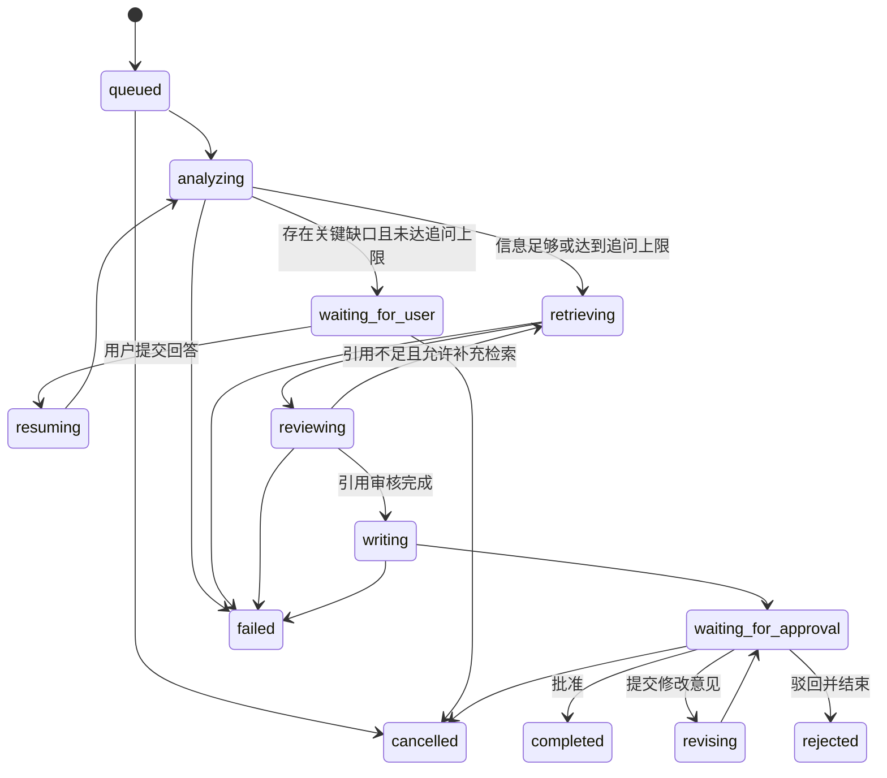

# 律镜 Legal Copilot Agent：未来优化实施计划

- 文档状态：持续实施（第八周已完成）
- 当前基线：1.2.0（第八周已完成）
- 规划周期：第 5～12 周
- 第一优先级：法规版本与案件日期检索
- 文档用途：用于后续开发执行、阶段验收、求职讲解和技术方案评审

> 本文中的 `[ ]` 表示尚未实现。每完成一个阶段，应更新实际完成日期、测试结果、接口文档和学习记录，不得仅修改勾选状态而不提供验收证据。

## 1. 为什么还要继续优化

当前项目已经具备：

1. 案件材料上传和文本解析；
2. 规则或 LLM 案件要素提取；
3. 关键词与 Embedding 混合检索；
4. 数据库原文一致性和引用审核；
5. LangGraph 工作流和节点轨迹；
6. 在线模型失败后的透明降级；
7. Markdown/PDF 报告；
8. 法规知识库录入、批量导入和 Agent TXT 整理；
9. 离线评测、自动测试、CI 和 Docker 配置。

本文最初规划时，核心工作流仍是“一次提交、一次完成”：

```text
提交问题
  → 提取要素
  → 检索法规
  → 审核引用
  → 生成报告
  → completed
```

即使要素提取已经返回 `missing_information` 和 `questions_for_user`，系统也只会把它们写进报告，不会停下来等待用户补充。报告生成后同样没有正式的“批准、修改、驳回、重新生成”流程。

第 5～8 周已经逐步把它升级为：

> 一个能够发现信息缺口、暂停执行、向用户追问、保存状态、恢复工作流、提交报告草稿并经过人工审批的可审计法律 Agent。

## 2. 总体设计原则

后续所有功能遵守以下原则：

1. **模型输出不是事实**：必须经过 Schema、数据库、原文定位或人工确认。
2. **高风险动作必须审批**：法规写入、报告发布、外部工具写操作不能由模型自行完成。
3. **工作流必须可恢复**：服务重启后不能丢失等待中的问题、回答和审批任务。
4. **副作用必须幂等**：恢复节点或消息重复投递不能产生重复报告、重复法规或重复审计记录。
5. **状态转换必须可验证**：客户端不能跳过追问或直接把任务状态改成已批准。
6. **观测信息不泄露隐私**：记录耗时、Token、模型和错误码，不记录密钥或完整案件正文。
7. **离线能力继续保留**：自动测试和基础演示不能强制依赖模型、Redis 或云服务。
8. **每个新增能力都要可评测**：不能只凭页面“看起来更智能”判断是否有效。
9. **每周必须独立交付**：本周结束时必须新增一个可以单独使用、单独演示、单独测试的完整功能，不能依赖下一周补齐闭环。

## 3. 路线图优先级

| 优先级 | 阶段 | 功能 | 预计周期 | 面试能力 |
|---|---|---|---:|---|
| P0 | A | 多轮追问、暂停与恢复 | 1 周 | LangGraph 状态、HITL、持久化 |
| P0 | B | 报告人工审批与版本管理 | 1 周 | 审批流、并发控制、审计 |
| P0 | C | 法规效力与版本治理 | 1 周 | 领域建模、时态检索、可信 RAG |
| P1 | D | OpenTelemetry 可观测性与费用 | 1 周 | Trace、指标、故障定位、成本 |
| P1 | E | 持久任务队列与实时进度 | 1 周 | 队列、幂等、重试、SSE |
| P1 | F | 登录、RBAC 与审计日志 | 1 周 | JWT、权限、数据安全 |
| P2 | G | Agent 安全和红队评测 | 1 周 | Prompt Injection、防泄漏 |
| P2 | H | MCP Server 外部接入 | 1 周 | 工具协议、外部集成 |

推荐严格按 A → B → C → D → E → F 的顺序实现。不要同时启动多个大阶段。

### 3.1 每周独立交付规则

每一周必须同时满足：

1. **有新入口**：用户可以在页面、API、管理后台或外部客户端找到本周功能。
2. **有完整闭环**：输入、处理、结果和错误路径全部可用。
3. **可以停在本周版本**：即使后续周次永远不开发，本周版本仍然是合理、可运行的产品。
4. **有独立验收**：本周有自己的测试、接口文档、演示脚本和完成标准。
5. **不伪装完成**：只建表、只画页面、只写接口但没有真实数据流，不算一个独立功能。

周与周之间允许复用已有能力，但不能出现：

```text
第 5 周只保存问题
  → 第 6 周才能回答
```

正确拆分应当是：

```text
第 5 周：发现缺失 → 追问 → 回答 → 恢复 → 生成现有最终报告
第 6 周：在已经可生成的报告之上，新增草稿 → 审批/修改/驳回 → 最终发布
```

---

# 第一阶段：多轮追问 Agent

## 4. 阶段目标

当 Agent 判断案件信息不足时，不立即生成低质量报告，而是：

1. 保存当前工作流状态；
2. 把最重要的缺失信息转换成明确问题；
3. 将运行状态改成 `waiting_for_user`；
4. 前端展示问题并等待用户回答或补充文件；
5. 用户回答后恢复原工作流；
6. 合并新事实并重新判断是否仍需追问；
7. 达到信息条件或追问上限后继续法规检索。

## 5. 用户故事

### 5.1 合同纠纷

用户输入：

```text
供应商收款后一直没有发货，我可以解除合同吗？
```

Agent 识别缺失：

- 合同约定的交货日期；
- 是否已经催告；
- 付款金额和付款凭证；
- 对方是否明确拒绝履行。

前端展示：

```text
为了判断是否达到合同解除条件，请补充：
1. 合同约定的最晚交货日期是什么？
2. 你是否已经通过书面方式催告？如果有，请填写日期或上传记录。
3. 对方是否明确表示不再发货？
```

用户回答后，Agent 不创建一个无关的新案件，而是在原 `run_id/thread_id` 上恢复。

### 5.2 劳动争议

如果用户只说“公司辞退我了”，Agent 应追问：

- 入职和离职日期；
- 是否签订合同；
- 工资标准；
- 辞退通知形式和理由；
- 是否存在试用期、严重违纪等争议事实。

### 5.3 食品安全

Agent 应优先询问：

- 购买时间和渠道；
- 食用与症状发生的时间关系；
- 就诊记录；
- 剩余食品、订单和付款凭证；
- 是否向平台、商家或监管部门反馈。

## 6. 工作流状态设计

### 6.1 建议状态

| 状态 | 含义 | 是否终态 |
|---|---|---|
| `queued` | 已创建，等待执行 | 否 |
| `analyzing` | 正在提取案件要素 | 否 |
| `waiting_for_user` | 工作流已暂停，等待补充事实 | 否 |
| `resuming` | 正在合并用户回答并恢复 | 否 |
| `retrieving` | 正在检索法规 | 否 |
| `reviewing` | 正在审核引用 | 否 |
| `writing` | 正在生成报告草稿 | 否 |
| `waiting_for_approval` | 草稿完成，等待人工审批 | 否 |
| `revising` | 根据审批意见修改报告 | 否 |
| `completed` | 报告已批准并完成 | 是 |
| `rejected` | 报告被终止，不再继续修改 | 是 |
| `failed` | 发生不可恢复错误 | 是 |
| `cancelled` | 用户主动取消 | 是 |

### 6.2 状态转换



禁止的转换示例：

- `waiting_for_user → completed`
- `queued → waiting_for_approval`
- `failed → completed`
- 已经 `completed` 后再次提交批准

非法状态转换统一返回 HTTP 409。

## 7. 追问触发规则

第一版使用可解释的确定性规则，不要完全交给 LLM 自行决定。

建议条件：

```text
需要追问 =
    mode == agent
    AND clarification_round < MAX_CLARIFICATION_ROUNDS
    AND (
        facts.confidence < CLARIFICATION_CONFIDENCE_THRESHOLD
        OR missing_information 非空
        OR questions_for_user 非空
    )
```

建议配置：

```env
MAX_CLARIFICATION_ROUNDS=3
MAX_QUESTIONS_PER_ROUND=5
CLARIFICATION_CONFIDENCE_THRESHOLD=0.70
CLARIFICATION_TIMEOUT_HOURS=72
```

补充规则：

1. 每轮最多询问五个问题；
2. 问题按对法律结论影响排序；
3. 不重复询问用户已经回答的问题；
4. 用户可以选择“不清楚”，系统把它记录为明确未知；
5. 超过三轮后继续生成报告，但必须强调仍缺少的事实；
6. 离线模式默认不暂停，继续沿用当前一次性演示流程；
7. 追问不能要求用户提交与案件无关的敏感数据。

## 8. 数据模型计划

### 8.1 扩展 `agent_runs`

计划新增：

```text
thread_id                 会话 ID
clarification_round       已完成追问轮数
pending_action            clarification / report_approval / null
state_version             乐观锁版本
checkpoint_thread_id      LangGraph checkpoint 使用的线程标识
waiting_since             开始等待时间
cancelled_at              取消时间
```

### 8.2 新增 `case_threads`

```text
id
title
status
created_by
latest_run_id
created_at
updated_at
```

作用：

- 一个案件可以包含多轮消息和多次运行；
- 避免把每次回答误当成完全独立的案件；
- 支持未来的案件列表和继续分析。

### 8.3 新增 `case_messages`

```text
id
thread_id
run_id
role                     user / agent / system
message_type             initial_question / clarification_question /
                         clarification_answer / material_note
content
attachment_name
attachment_text
created_at
```

约束：

- 不在日志中打印 `content` 和 `attachment_text`；
- 附件仍使用现有上传安全服务；
- 删除会话时按隐私策略级联或匿名化。

### 8.4 新增 `agent_interrupts`

```text
id
run_id
interrupt_id             LangGraph 返回的中断 ID
interrupt_type           clarification / report_approval
payload_json             展示给前端的安全结构化信息
response_json            用户回答、批准结果或修改意见
status                   pending / resolved / cancelled / expired
expected_state_version
created_at
resolved_at
```

数据库约束：

- `interrupt_id` 唯一；
- 同一个 `run_id + interrupt_type` 只允许一个 pending 记录；
- 已解决的 interrupt 不允许再次提交；
- `expected_state_version` 不一致时返回 409，防止两个浏览器重复审批。

## 9. LangGraph 改造计划

当前图：

```text
analyze_case
  → retrieve_laws
  → review_citations
  → retry_retrieval / write_report
```

目标图：

```text
analyze_case
  → decide_clarification
      ├─ need_more_information
      │    → ask_user
      │    → interrupt
      │    → merge_user_answer
      │    → analyze_case
      └─ enough_information
           → retrieve_laws
           → review_citations
           → write_report_draft
           → request_report_approval
           → interrupt
               ├─ approve → publish_report
               ├─ revise  → revise_report → request_report_approval
               └─ reject  → rejected
```

### 9.1 新节点

| 节点 | 职责 |
|---|---|
| `decide_clarification` | 根据事实缺口、置信度和轮数决定是否暂停 |
| `ask_user` | 生成去重、排序后的结构化问题 |
| `merge_user_answer` | 合并回答和新材料，不覆盖原始问题 |
| `write_report_draft` | 生成草稿，但不标记 completed |
| `request_report_approval` | 发送草稿摘要、引用和风险提示 |
| `revise_report` | 根据明确修改意见生成新版本 |
| `publish_report` | 人工批准后设置 completed |

### 9.2 Checkpointer

第一版本地实现建议：

- 使用 SQLite checkpointer；
- `thread_id` 使用不可猜测的 UUID，不直接使用自增 `run_id`；
- checkpoint 数据库与业务数据库可以先共用文件，但表名分离；
- 自动测试使用临时 SQLite；
- 生产化阶段迁移 PostgreSQL checkpointer。

LangGraph `interrupt()` 恢复时会重新执行当前节点，因此必须：

1. 把不可重复副作用放在 interrupt 之后；
2. 写库操作使用唯一约束或 upsert；
3. 不在 interrupt 前发送外部消息；
4. 不用宽泛 `except Exception` 捕获 interrupt；
5. 保证节点中 interrupt 的顺序稳定。

参考：[LangGraph Interrupts](https://langchain-ai.github.io/langgraph/how-tos/human_in_the_loop/breakpoints/)

## 10. 多轮追问 API 计划

### 10.1 创建会话

```http
POST /api/v1/threads
```

响应：

```json
{
  "thread_id": "th_01J...",
  "status": "active",
  "created_at": "2026-07-26T10:00:00+08:00"
}
```

### 10.2 在会话中创建运行

保留当前接口并增加可选字段：

```http
POST /api/v1/runs
Content-Type: multipart/form-data

question=...
mode=agent
thread_id=th_01J...
file=<optional>
```

### 10.3 查询待处理动作

```http
GET /api/v1/runs/{run_id}/pending-action
```

响应：

```json
{
  "run_id": 81,
  "action": "clarification",
  "interrupt_id": "int_01J...",
  "state_version": 3,
  "round": 1,
  "questions": [
    {
      "question_id": "q1",
      "text": "合同约定的最晚交货日期是什么？",
      "reason": "影响是否构成迟延履行",
      "required": true,
      "answer_type": "text"
    }
  ],
  "expires_at": "2026-07-29T10:00:00+08:00"
}
```

### 10.4 提交追问回答

```http
POST /api/v1/runs/{run_id}/clarifications
Idempotency-Key: <UUID>
```

```json
{
  "interrupt_id": "int_01J...",
  "expected_state_version": 3,
  "answers": [
    {
      "question_id": "q1",
      "answer": "合同约定2026年6月30日前交货"
    }
  ]
}
```

响应使用 202，工作流进入 `resuming`。

### 10.5 取消等待

```http
POST /api/v1/runs/{run_id}/cancel
```

只有非终态任务可以取消。重复取消返回当前 `cancelled` 状态，不重复写审计记录。

## 11. 多轮追问前端计划

### 11.1 运行轨迹

在现有四节点轨迹中增加：

- 信息完整度判断；
- 等待用户补充；
- 合并补充信息；
- 等待报告审批；
- 根据意见修改；
- 正式发布。

### 11.2 追问卡片

需要显示：

- 当前第几轮；
- 每个问题的提问原因；
- 必填/可选；
- 文本、日期、金额、是/否等输入类型；
- 上传补充材料；
- 暂时不清楚；
- 提交后不可直接修改的提示。

### 11.3 会话时间线

按照时间显示：

```text
用户原始问题
Agent 第一轮追问
用户第一轮回答
Agent 第二轮追问
用户上传补充文件
Agent 报告草稿
人工审批结果
```

时间线只展示公开动作摘要，不展示模型隐藏思维链。

## 12. 多轮追问测试计划

### 12.1 服务层

- `[ ]` 缺失信息时生成 1～5 个不重复问题；
- `[ ]` 已回答问题不会再次出现；
- `[ ]` 达到三轮后不再中断；
- `[ ]` 低置信度但没有问题时生成安全兜底追问；
- `[ ]` 离线模式保持现有行为；
- `[ ]` “不清楚”不会被模型改写成肯定事实。

### 12.2 工作流

- `[ ]` `interrupt()` 后状态为 `waiting_for_user`；
- `[ ]` 重启进程后能够从 checkpoint 读取 pending interrupt；
- `[ ]` 回答后从正确节点恢复；
- `[ ]` 恢复不会重复写引用；
- `[ ]` 重复提交同一个 Idempotency-Key 只处理一次；
- `[ ]` 旧 `state_version` 返回 409；
- `[ ]` 取消后的任务不能恢复。

### 12.3 API

- `[ ]` 无待处理问题时提交回答返回 409；
- `[ ]` interrupt ID 不属于当前 run 时返回 404 或 409；
- `[ ]` 答案超过长度限制返回 422；
- `[ ]` 新附件仍执行 MIME、大小、空文件和解析超时校验；
- `[ ]` 未授权用户不能回答其他人的任务。

### 12.4 验收标准

- `[ ]` 完成合同、劳动、食品安全三个完整追问场景；
- `[ ]` 服务重启后继续原任务；
- `[ ]` 所有状态转换有自动测试；
- `[ ]` 页面刷新不丢失待回答问题；
- `[ ]` 自动测试不调用真实 LLM；
- `[ ]` Apifox 文档能够演示创建、等待、回答和恢复。

---

# 第二阶段：人工审批 Agent

## 13. 阶段目标

报告生成后先保存为草稿，只有人工批准后才成为最终报告。审批人可以：

1. 批准；
2. 驳回并结束；
3. 提交修改意见；
4. 直接编辑允许修改的内容；
5. 查看每个版本的差异和引用变化。

## 14. 审批边界

人工可以修改：

- 报告表达；
- 案件摘要；
- 风险提示；
- 建议补充的证据；
- 是否采用某条已经审核的引用。

人工不能直接修改：

- 数据库法条原文；
- `article_id`；
- 法规效力状态；
- 模型调用记录；
- 历史审批日志。

需要修改法规原文时，必须进入独立的知识库审核流程。

## 15. 报告版本模型

新增 `report_versions`：

```text
id
run_id
version_number
title
markdown
facts_snapshot
citations_snapshot
change_summary
created_by_type          agent / human
status                   draft / changes_requested / approved / rejected
reviewer_id
review_comment
created_at
reviewed_at
```

约束：

- `(run_id, version_number)` 唯一；
- 已批准版本只读；
- 新修改生成下一版本，不能覆盖历史；
- 报告导出只能导出 approved 版本；
- 引用快照必须保留 article ID 和当时的版本信息。

## 16. 审批 API

```http
GET  /api/v1/runs/{run_id}/report-versions
GET  /api/v1/runs/{run_id}/report-versions/{version}
POST /api/v1/runs/{run_id}/approvals
```

批准：

```json
{
  "interrupt_id": "int_approval_01J...",
  "expected_state_version": 8,
  "action": "approve",
  "comment": "引用和风险提示已核对"
}
```

要求修改：

```json
{
  "interrupt_id": "int_approval_01J...",
  "expected_state_version": 8,
  "action": "request_changes",
  "comment": "请把合同解除条件与一般违约责任分开说明"
}
```

驳回：

```json
{
  "interrupt_id": "int_approval_01J...",
  "expected_state_version": 8,
  "action": "reject",
  "comment": "材料真实性无法确认，停止生成"
}
```

## 17. 审批前端

- `[x]` 报告顶部显示“草稿，尚未批准”；
- `[x]` 引用逐条打开数据库原文；
- `[x]` 显示证据缺口和低置信度项；
- `[x]` 批准、要求修改、驳回三个明确按钮；
- `[x]` 要求修改必须填写原因；
- `[x]` 展示版本列表和 Markdown 差异；
- `[x]` 只有批准后显示 PDF/Markdown 最终下载；
- `[x]` 防止重复点击和两个页面同时审批。

## 18. 审批验收标准

- `[x]` 未批准报告不能导出为“最终报告”；
- `[x]` 每次修改生成新版本；
- `[x]` 历史版本不可覆盖；
- `[x]` 两个客户端同时审批时只有一个成功；
- `[x]` 审批动作写入追加式业务记录；
- `[x]` LLM 不能伪造“已批准”状态；
- `[x]` 报告引用仍然通过 article ID 回查。

---

# 第三阶段：法规版本与效力管理

## 19. 为什么这是法律项目的重要差异点

语义最相似的法条不一定在案件发生时有效。仅检索名称、条号和正文会出现：

- 引用了已经废止的条文；
- 忽略修订前后的正文差异；
- 案件发生日期早于法规施行日期；
- 来源存在但没有记录核验时间；
- 同一个条号的多个版本互相覆盖。

面试中可以把这一阶段概括为：

> 从“相似内容检索”升级到“带时间和版本约束的法律检索”。

## 20. 数据模型

建议将法规实体和版本拆开：

### `laws`

```text
id
official_name
short_name
jurisdiction
authority
law_type
```

### `law_versions`

```text
id
law_id
version_label
promulgation_date
effective_date
expiry_date
status                   draft / effective / amended / repealed
source_url
source_checked_at
content_hash
supersedes_version_id
```

### `legal_articles`

增加：

```text
law_version_id
article_order
article_number_normalized
```

## 21. 检索改变

搜索请求增加可选：

```json
{
  "query": "解除合同条件",
  "limit": 5,
  "as_of_date": "2025-06-01",
  "jurisdiction": "CN"
}
```

过滤顺序：

```text
权限和租户过滤
  → 地域过滤
  → as_of_date 效力过滤
  → 关键词/向量候选
  → 综合排序
  → 引用一致性审核
```

不能先向量 Top-K 后再过滤，否则有效条文可能在召回阶段已经被淘汰。

## 22. 验收标准

- `[x]` 同一法规可以保存多个版本；
- `[x]` 条文通过 `law_version_id` 绑定到精确版本；
- `[x]` 指定案件日期时只返回当时有效版本；
- `[x]` 不指定日期时默认当前有效版本；
- `[x]` 已废止条文在界面明确标红；
- `[x]` 报告保存引用时同时保存法条版本 ID；
- `[ ]` 来源核验超过配置期限时提示重新检查。

---

# 第四阶段：Agent 可观测性与费用面板

## 23. 目标

当前已经保存节点、耗时和动作摘要。下一步接入 OpenTelemetry，使一次请求能够串联：

```text
前端请求
  → FastAPI
  → Agent 工作流
  → analyze_case
  → Chat LLM
  → Embedding
  → 数据库检索
  → citation review
  → report draft
```

## 24. Trace 设计

建议 Span：

- `POST /api/v1/runs`
- `agent.invoke`
- `agent.analyze_case`
- `gen_ai.chat`
- `agent.retrieval`
- `gen_ai.embeddings`
- `db.search_articles`
- `agent.review_citations`
- `agent.write_report`
- `agent.interrupt`
- `agent.resume`

建议属性：

```text
run.id
thread.id
agent.mode
agent.node
gen_ai.provider.name
gen_ai.request.model
gen_ai.usage.input_tokens
gen_ai.usage.output_tokens
retrieval.provider
retrieval.candidate_count
retrieval.verified_count
fallback.reason
retry.count
```

禁止记录：

- API Key；
- 完整案件材料；
- 完整 Prompt；
- 用户身份证、电话、住址；
- 工具调用中的敏感参数。

OpenTelemetry GenAI 已定义 chat、embeddings、retrieval、invoke_agent 和 execute_tool 等操作语义，可优先沿用标准名称：

[OpenTelemetry GenAI semantic conventions](https://opentelemetry.io/docs/specs/semconv/registry/attributes/gen-ai/)

## 25. 指标面板

- 每日 Agent 运行数；
- 成功率；
- 降级率；
- 平均/P95 总耗时；
- 各节点平均/P95 耗时；
- LLM 认证失败、限流、超时次数；
- Embedding 降级次数；
- 平均输入/输出 Token；
- 每个模型估算费用；
- 平均追问轮数；
- 等待人工回答时长；
- 报告一次批准率；
- 报告平均修改版本数。

## 26. 验收标准

- `[x]` 一个 Trace ID 能串联 API、工作流、模型和检索节点；
- `[x]` 状态接口返回 Trace ID；
- `[x]` 日志、Span 和数据库运行记录可以相互定位；
- `[x]` 敏感字段不进入遥测；
- `[x]` 可以回答“慢在哪个节点、为什么降级、花了多少 Token”。

---

# 第五阶段：持久任务队列与实时进度

## 27. 当前问题

当前使用 FastAPI 进程内后台任务：

- 服务退出时未完成任务不能自动恢复；
- 多实例之间无法共享队列；
- 缺少任务取消、死信和统一重试；
- 前端只能轮询。

## 28. 推荐方案

第一版推荐：

```text
FastAPI
  → Redis
  → Celery/RQ/Dramatiq Worker
  → SQLAlchemy
  → LangGraph Checkpointer
```

如果希望展示已有 Java/RocketMQ 经历，可在后续增加 RocketMQ 适配层，但不要为了技术栈数量同时维护两套队列。

## 29. 队列要求

- `[ ]` `run_id` 作为业务幂等键；
- `[ ]` 同一运行不能被两个 Worker 同时执行；
- `[ ]` 任务领取使用数据库状态条件更新；
- `[ ]` 可重试错误与不可重试错误分开；
- `[ ]` 指数退避并带随机抖动；
- `[ ]` 最大重试次数明确；
- `[ ]` Worker 崩溃后任务重新投递；
- `[ ]` 重复投递不会重复生成引用和版本；
- `[ ]` 失败任务进入可检查列表；
- `[ ]` 支持取消尚未开始和等待中的任务。

## 30. SSE 实时进度

新增：

```http
GET /api/v1/runs/{run_id}/events
Accept: text/event-stream
```

事件示例：

```text
event: node_started
data: {"node":"retrieve_laws","progress":40}

event: node_completed
data: {"node":"retrieve_laws","progress":55,"candidate_count":5}

event: interrupted
data: {"action":"clarification","interrupt_id":"int_..."}
```

浏览器断线后使用 `Last-Event-ID` 继续，不因重连重复改变任务状态。

---

# 第六阶段：登录、RBAC 与审计

## 31. 角色

| 角色 | 权限 |
|---|---|
| `viewer` | 查看自己有权访问的案件和已批准报告 |
| `analyst` | 创建案件、回答追问、提交报告审批 |
| `reviewer` | 审批或要求修改报告 |
| `knowledge_admin` | 新增、批量导入和管理法规 |
| `system_admin` | 用户、角色、配置和审计管理 |

## 32. 认证

- 短期 Access Token；
- 可撤销 Refresh Token；
- 密码只保存强哈希；
- 登录失败限流；
- 密钥和密码不写日志；
- API 在服务端校验角色，不能只隐藏前端按钮；
- 默认关闭公网注册。

## 33. 审计日志

记录：

```text
actor_id
actor_role
action
resource_type
resource_id
request_id
before_hash
after_hash
reason
ip_hash
created_at
```

必须审计：

- 法规新增、修改、删除；
- Agent TXT 整理结果正式入库；
- 报告批准、驳回和要求修改；
- 用户角色变更；
- 任务人工重试或取消；
- 敏感配置修改。

审计表使用追加写，不提供普通更新接口。

---

# 第七阶段：Agent 安全与红队评测

## 34. 攻击数据集

新增 `eval/security_dataset.jsonl`，至少覆盖：

1. 直接 Prompt Injection；
2. 上传文档中的间接指令；
3. 请求输出环境变量和 API Key；
4. 请求泄漏其他案件；
5. 伪造“管理员已批准”；
6. 诱导模型编造法规；
7. SQL 注入文本；
8. 路径穿越文件名；
9. 超长输入和资源消耗；
10. 恶意工具参数；
11. Markdown/HTML 注入；
12. 伪造法规来源。

OWASP 2025 LLM 风险仍将 Prompt Injection 列为核心风险：

[OWASP Top 10 for LLM and GenAI Applications](https://genai.owasp.org/llm-top-10/)

## 35. 安全门

- LLM 不能访问环境变量；
- 上传文本始终作为不可信数据；
- 工具参数经过 Pydantic Schema；
- 写工具必须人工批准；
- 工具使用 allowlist；
- 模型不能直接修改数据库状态；
- 报告只能引用数据库存在且审核通过的 article ID；
- 多租户查询必须先做租户过滤；
- 遥测不记录完整敏感正文；
- 安全数据集进入 CI。

## 36. 安全指标

```text
prompt_injection_resistance_rate
cross_case_leakage_rate
unauthorized_tool_call_rate
fabricated_citation_rate
approval_bypass_rate
sensitive_output_rate
```

任何以下指标非零都应阻止发布：

- 跨案件泄漏；
- 未授权写工具调用；
- 审批绕过；
- 密钥泄漏。

---

# 第八阶段：MCP Server 与反馈闭环

## 37. MCP Server

目标：让其他支持 MCP 的客户端能够使用本项目能力，而不仅限于当前网页。

### Resources

- `legal://articles/{article_id}`：法规原文；
- `legal://laws/{law_id}/versions`：法规版本；
- `legal://runs/{run_id}/approved-report`：已批准报告；
- `legal://schemas/case-facts`：案件要素 Schema。

### Tools

- `search_laws`
- `get_article`
- `analyze_case`
- `get_run_status`
- `submit_clarification`

第一版不要暴露法规写入和报告批准工具。确需增加时必须使用用户授权与人工审批。

### Prompts

- 合同纠纷要素提取；
- 劳动争议证据清单；
- 消费者权益事实补充；
- 审核报告引用。

MCP 官方将服务器能力分为带 Schema 的 Tools、只读 Resources 和可复用 Prompts：

[MCP Server concepts](https://modelcontextprotocol.io/docs/learn/server-concepts)

## 38. 用户反馈

报告页面增加：

- 这条引用是否相关；
- 案件类型是否正确；
- 哪项关键事实提取错误；
- 报告是否解决问题；
- 修改后的正确内容；
- 反馈原因。

反馈不能直接改变模型或法规，而是进入待审核数据集。

## 39. 反馈闭环

```text
用户反馈
  → 脱敏
  → 人工审核
  → 转成评测样例
  → 离线回归
  → 对比新旧 Prompt / 模型 / 检索策略
  → 指标通过
  → 灰度发布
```

需要记录：

- 数据集版本；
- Prompt 版本；
- 模型版本；
- Embedding 版本；
- 评测时间；
- 指标差异；
- 是否批准发布。

---

# 第九阶段：数据库和部署生产化

## 40. PostgreSQL 与 pgvector

满足以下任一条件时迁移：

- 多实例部署；
- 多用户并发写入；
- 法规达到十万级；
- 需要原生向量索引；
- 需要可靠锁和任务领取；
- 需要更完整的权限审计。

迁移内容：

- SQLite → PostgreSQL；
- JSON 向量 → pgvector；
- `create_all` → Alembic migration；
- 唯一约束和外键重新验证；
- 连接池、超时和事务隔离；
- 备份与恢复演练；
- 测试继续支持临时 SQLite 或测试 PostgreSQL。

## 41. 多环境

```text
development
testing
staging
production
```

要求：

- 配置分层；
- 密钥只放 Secret 管理；
- 数据库迁移先在 staging 验证；
- 生产默认关闭 Swagger 写接口；
- CORS 使用明确域名；
- 健康检查拆分 liveness/readiness；
- 灰度发布失败可以回滚。

---

# 第 5～12 周执行安排

## 42. 第 5 周：可暂停、可恢复的多轮追问（已完成）

### 本周独立新增功能

Agent 发现关键事实不足时，暂停任务并在前端追问；用户回答后恢复同一个任务，继续完成法规检索和现有报告生成。

第五周结束后即使不做第六周，用户也能获得完整最终报告。

### 独立演示路径

```text
输入“供应商收款后没有发货，我能解除合同吗”
  → Agent 发现缺少约定交货日期
  → 状态变为 waiting_for_user
  → 前端显示“合同约定的交货日期是什么”
  → 用户填写“2026年6月30日”
  → 状态变为 resuming
  → 原 run_id 继续检索和生成报告
  → 状态 completed
  → Markdown/PDF 正常下载
```

### 本周任务

#### 第 1 天：状态和 Schema

- `[x]` 增加 `waiting_for_user/resuming`；
- `[x]` 定义 ClarificationQuestion、PendingAction、ClarificationAnswer；
- `[x]` 定义允许和禁止的状态转换；
- `[x]` 写状态转换测试。

#### 第 2 天：持久化

- `[x]` 增加最小可用的 clarification/interrupt 业务表；
- `[x]` `AgentRun` 增加 clarification round 和 checkpoint thread ID；
- `[x]` 接入 `langgraph-checkpoint-sqlite` 持久化 checkpointer；
- `[x]` 测试应用上下文重启后仍能查询待回答问题并恢复。

#### 第 3 天：LangGraph

- `[x]` 在 analyze 后增加条件判断，并实现 ask/merge 追问节点；
- `[x]` 实现 `interrupt` 和 `Command(resume=...)`；
- `[x]` 设置最多三轮、每轮最多五问；
- `[x]` 回答后继续进入现有 retrieve/review/write 节点。

#### 第 4 天：API

- `[x]` `GET /runs/{id}/pending-action`；
- `[x]` `POST /runs/{id}/clarifications`；
- `[x]` 支持 Idempotency-Key 和 expected state version；
- `[x]` 更新 OpenAPI 和 Apifox。

#### 第 5 天：前端

- `[x]` 增加追问卡片；
- `[x]` 支持文本回答和“暂不清楚”；
- `[x]` 展示恢复进度；
- `[x]` 刷新页面后重新加载待回答问题。

#### 第 6～7 天：测试、文档和演示

- `[x]` checkpoint 连接重建后的恢复测试；
- `[x]` 重复回答测试；
- `[x]` 三轮上限测试；
- `[x]` 合同交付追问完整场景，并回归原有劳动、食品安全场景；
- `[x]` 更新接口、自测、产品和学习文档。

### 第五周完成标准

- `[x]` 追问、回答、恢复、报告四步全部可用；
- `[x]` 不需要第六周的人工审批也能得到当前版本的最终报告；
- `[x]` 原有不需要追问的案件仍能直接完成；
- `[x]` 离线模式仍可独立运行；
- `[x]` 有一段三分钟内可完成的演示。

### 实际交付说明

- 发布版本：`0.9.0`；
- 自动测试：62 项全部通过，其中第五周新增 6 项；
- 质量检查：Ruff、mypy、TypeScript 和 Vite 生产构建通过；
- 数据库：`agent_clarifications` 与 LangGraph checkpoint 表共用当前 SQLite 文件；
- 任务执行仍使用 FastAPI 进程内后台任务；等待回答的状态可以跨重启恢复，但执行到一半时进程崩溃的自动重领属于第九周持久队列功能。

### 不留给第六周补的内容

- 回答提交接口；
- checkpoint 恢复；
- 前端追问卡片；
- 恢复后的报告生成；
- 追问错误和重复提交处理。

## 43. 第 6 周：报告草稿与人工审批

### 本周独立新增功能

在第五周已经能够生成完整报告的基础上，新增“草稿—审批—发布”流程。报告未经批准时明确标记为草稿；用户可以批准、要求修改或驳回。

### 独立演示路径

```text
任意案件完成分析
  → 生成报告草稿
  → 状态 waiting_for_approval
  → 审核人打开引用和证据缺口
  ├─ 批准 → completed → 可下载最终报告
  ├─ 要求修改 → 生成版本 2 → 再次审批
  └─ 驳回 → rejected
```

这周可以用“不需要追问”的案件单独演示，因此审批功能不依赖第五周一定触发追问。

### 本周任务

- `[x]` 新增 `report_versions`；
- `[x]` 增加 `waiting_for_approval/revising/rejected`；
- `[x]` 增加 approval interrupt；
- `[x]` 实现 approve/request_changes/reject；
- `[x]` 增加 expected state version 乐观锁；
- `[x]` 增加报告版本列表和差异页面；
- `[x]` 最终导出只读取 approved 版本；
- `[x]` 保留全部草稿和审批意见；
- `[x]` 更新 Apifox、自动测试和演示脚本。

### 第六周完成标准

- `[x]` 不经过审批不能下载“最终报告”；
- `[x]` 批准、修改、驳回三条路径都能独立结束；
- `[x]` 两个浏览器同时审批时只有一个成功；
- `[x]` 每次修改都产生新版本，历史内容不覆盖；
- `[x]` 即使不做第七周，审批功能仍然完整可用。

### 实际交付说明

- 发布版本：`1.0.0`；
- 自动测试：69 项全部通过，其中第六周新增 7 项；
- 数据库：新增 `report_versions`、`agent_approvals`，并为 `agent_runs` 增加当前/已批准版本字段；
- 工作流：`write_report → approve_report interrupt`，修改路径为 `revise_report → approve_report`；
- 接口：新增审批提交、版本列表和版本详情，`pending-action` 扩展为追问/审批联合待办；
- 导出：新版本只有 `approved` 状态可导出，升级前已经完成的历史报告保留兼容下载；
- 离线修改：为避免编造新事实，离线模式只追加明确的审批修改说明；Agent 模式可调用在线 LLM 进行语义修订；
- 用户与角色权限仍属于第十周，当前审核人字段用于本地演示和审计，不代表已经实现身份认证。

## 44. 第 7 周：按案件日期检索有效法规（已完成）

### 本周独立新增功能

用户可以输入案件发生日期，系统只检索当时有效的法规版本，并在引用中展示版本和效力状态。

### 独立演示路径

```text
同一个法律问题
  → 分别选择修订前日期和修订后日期
  → 检索得到不同法条版本
  → 引用卡片显示 effective / amended / repealed
```

### 本周任务

- `[x]` 增加 laws/law_versions；
- `[x]` 保存生效、失效和替代关系；
- `[x]` 搜索、同步案件和 Agent 接口增加 `as_of_date`；
- `[x]` 在召回前过滤效力区间；
- `[x]` 报告引用保存 law version ID；
- `[x]` 前端显示版本和效力标签；
- `[x]` 准备《合同法》第九十四条到《民法典》第五百六十三条的前后版本演示数据；
- `[x]` 增加日期边界自动测试。

### 第七周完成标准

- `[x]` 指定两个不同日期能得到可解释的不同版本；
- `[x]` 已废止条文不会作为当前有效条文返回；
- `[x]` 不填写日期时仍兼容原调用；
- `[x]` 不依赖第八周监控功能即可完整使用。

### 实际交付说明

- 版本：`1.1.0`；
- 日期语义：`[effective_from, effective_to)`；
- 数据：新增 `laws`、`law_versions`，已有条文启动时增量回填；
- 持久化：案件、Agent、检索日志、引用和报告快照保留时间与版本证据；
- 自动测试：第七周新增 6 项，完整测试 75 项；
- 尚未完成：官方来源自动同步、`source_checked_at` 过期提醒和同一条号正文差异管理，继续作为后续独立功能。

## 45. 第 8 周：Agent 运行监控与费用面板（已完成）

### 本周独立新增功能

增加一个监控页面，用户可以按运行查看各节点耗时、模型、Token、估算费用、重试和降级原因。

### 独立演示路径

```text
执行一次 Agent 案件
  → 打开运行监控
  → 查看 API → LLM → Embedding → 检索 → 报告 Trace
  → 定位最慢节点
  → 查看实际模型、Token、费用和是否降级
```

### 本周任务

- `[x]` 接入 OpenTelemetry；
- `[x]` 为工作流节点建立 Span；
- `[x]` 记录输入/输出 Token 和估算费用；
- `[x]` 统计节点平均/P95；
- `[x]` 统计 LLM/Embedding 降级率；
- `[x]` 增加运行监控 API；
- `[x]` 增加前端监控详情页；
- `[x]` 对敏感属性使用 allowlist；
- `[x]` 增加“日志不得出现案件全文和密钥”测试。

### 第八周完成标准

- `[x]` 一个 Trace ID 能定位 API 请求和完整 Agent 运行；
- `[x]` 页面能回答“慢在哪、用了什么模型、是否降级、花费多少”；
- `[x]` 没有 Redis 和第九周队列也能工作；
- `[x]` 原有任务执行逻辑不受影响。

### 实际交付与验收证据

- 版本：`1.2.0`；
- 数据：`agent_runs` 保存聚合指标，`agent_run_spans` 保存 allowlist 后的节点与模型 Span；
- 接口：`GET /api/v1/monitoring/overview`、`GET /api/v1/runs/{run_id}/monitoring`；
- 前端：新增“运行监控”导航、概览卡片、节点平均/P95、最近运行和单次 Trace 瀑布；
- 隐私：不保存案件全文、Prompt、API Key、身份证、电话或住址；
- 费用：按 `.env` 中每百万 Token 单价估算，默认 0；
- 自动测试：第八周新增 7 项，完整离线测试 82 项；
- 当前边界：尚未接入 OTLP Collector、Prometheus、告警和遥测保留策略，这些不影响本周本地闭环。

## 46. 第 9 周：重启不丢任务的持久队列

### 本周独立新增功能

把进程内 BackgroundTasks 替换为持久 Worker；后端或 Worker 重启后，未完成任务可以恢复，并通过 SSE 实时显示进度。

### 独立演示路径

```text
创建一个 Agent 任务
  → Worker 开始执行
  → 人为停止 Worker
  → 重启 Worker
  → 同一 run_id 继续执行
  → 浏览器通过 SSE 收到后续进度
  → 最终报告只生成一次
```

### 本周任务

- `[ ]` Redis + Worker；
- `[ ]` 数据库条件更新领取任务；
- `[ ]` run ID 和任务 ID 幂等；
- `[ ]` 区分可重试和不可重试错误；
- `[ ]` 指数退避、最大次数和失败任务列表；
- `[ ]` Worker 崩溃恢复；
- `[ ]` 新增 `/runs/{id}/events` SSE；
- `[ ]` 前端从轮询优先升级为 SSE，断线时回退轮询；
- `[ ]` 增加重复投递和崩溃恢复测试。

### 第九周完成标准

- `[ ]` Worker 重启后任务不丢失；
- `[ ]` 同一任务重复投递不会生成重复引用或报告；
- `[ ]` SSE 断线重连不改变业务状态；
- `[ ]` 队列功能不依赖第十周登录才能演示。

## 47. 第 10 周：登录、角色权限与审计中心

### 本周独立新增功能

用户可以登录；不同角色看到不同操作；管理员可以在审计页面查看法规写入、报告审批、任务重试等操作记录。

### 独立演示路径

```text
viewer 登录
  → 可以查看已批准报告
  → 不能新增法规

knowledge_admin 登录
  → 可以新增法规
  → 审计中心出现操作记录
```

### 本周任务

- `[ ]` 用户、角色和 Refresh Token 表；
- `[ ]` JWT 登录和刷新；
- `[ ]` viewer/analyst/reviewer/knowledge_admin/system_admin；
- `[ ]` FastAPI 依赖层强制 RBAC；
- `[ ]` 前端根据权限展示入口；
- `[ ]` 新增 append-only audit log；
- `[ ]` 增加审计搜索页面；
- `[ ]` 登录失败限流；
- `[ ]` 增加越权 API 测试。

### 第十周完成标准

- `[ ]` 直接调用 API 也无法绕过权限；
- `[ ]` 至少两个角色能演示明显不同能力；
- `[ ]` 知识库写入和报告审批都有审计记录；
- `[ ]` 不依赖第十一周安全中心才能使用。

## 48. 第 11 周：Agent 安全评测中心

### 本周独立新增功能

提供一个可以主动运行的安全评测，自动测试 Prompt Injection、跨案件访问、审批绕过、虚假引用和敏感信息输出，并生成安全报告。

### 独立演示路径

```text
在安全评测页面选择测试集
  → 运行 12 类攻击样例
  → 显示通过率和失败样例
  → 高危指标非零时标记“禁止发布”
```

### 本周任务

- `[ ]` `eval/security_dataset.jsonl`；
- `[ ]` Prompt Injection 测试；
- `[ ]` 跨案件访问测试；
- `[ ]` 审批绕过测试；
- `[ ]` 环境变量和密钥泄漏测试；
- `[ ]` 虚假 article ID 测试；
- `[ ]` 安全评测命令和结果 JSON/Markdown；
- `[ ]` 前端安全结果页；
- `[ ]` CI 增加高危安全门。

### 第十一周完成标准

- `[ ]` 安全评测可以完全离线重复运行；
- `[ ]` 失败样例能定位风险类型和输入 ID；
- `[ ]` 跨案件泄漏、未授权写操作、审批绕过和密钥泄漏必须为零；
- `[ ]` 即使不做 MCP，本周也有完整可演示功能。

## 49. 第 12 周：MCP Server 外部接入

### 本周独立新增功能

将法规检索和案件分析能力通过 MCP 暴露给其他支持 MCP 的 AI 客户端，使项目不再只能通过自有网页调用。

### 独立演示路径

```text
MCP 客户端连接 LegalCopilot Server
  → 发现 search_laws/get_article/analyze_case
  → 调用 search_laws
  → 返回带 article ID 的法规
  → 调用 get_article 回查原文
```

### 本周任务

- `[ ]` 实现 MCP Server 生命周期；
- `[ ]` 提供只读法规 Resources；
- `[ ]` 提供 search_laws/get_article/analyze_case Tools；
- `[ ]` 为 Tool 输入定义 JSON Schema；
- `[ ]` Tool 调用复用现有服务层，不复制检索逻辑；
- `[ ]` 默认不暴露法规写入和报告审批；
- `[ ]` 增加 MCP 客户端配置示例；
- `[ ]` 增加协议、错误和权限测试；
- `[ ]` 更新架构图、演示视频、简历和面试问答。

### 第十二周完成标准

- `[ ]` 至少一个外部 MCP 客户端可以完成检索和原文回查；
- `[ ]` 返回结果继续保持 article ID 可追溯；
- `[ ]` MCP 不提供未经审批的高风险写工具；
- `[ ]` 第十二周本身形成独立的“外部 Agent 接入”功能。

### 第十二周以后独立候选

以下功能不再塞进第十二周，后续继续按“一周一个完整功能”安排：

- 用户反馈与在线评测闭环；
- PostgreSQL/pgvector 管理版；
- 法规官方来源定期同步；
- 多租户案件空间；
- 对象存储和材料生命周期管理。

---

# 50. 每阶段统一完成标准

一个阶段只有同时满足以下条件才算完成：

1. 功能在真实页面或 API 可使用；
2. 后端拥有确定性校验；
3. 正常、错误、重复和并发场景有测试；
4. 自动测试不产生真实模型费用；
5. OpenAPI 可以导入 Apifox；
6. README、产品、目标、自测和学习文档同步；
7. CI 通过；
8. 没有密钥、数据库和用户材料进入 Git；
9. 有一段可以在三分钟内演示的流程；
10. 能说明已知限制，不夸大法律能力。

# 51. 技术风险与对策

| 风险 | 表现 | 对策 |
|---|---|---|
| interrupt 恢复重复副作用 | 重复写引用或报告版本 | 副作用后置、唯一约束、幂等键 |
| 用户同时在两个页面提交 | 两次回答或两次审批 | state_version 乐观锁、HTTP 409 |
| 追问无限循环 | 一直要求补充 | 最多三轮、问题去重、超限继续 |
| 服务重启状态丢失 | waiting 任务无法恢复 | 持久 checkpointer、启动恢复检查 |
| LLM 编造已回答事实 | 报告出现用户没说过的内容 | 保存原始消息、事实来源标记、人工审批 |
| 报告版本覆盖 | 无法追责 | append-only 版本、approved 只读 |
| 队列重复投递 | 同任务执行两次 | 数据库领取锁、任务幂等 |
| Trace 泄露隐私 | 监控系统保存案件全文 | allowlist 属性、敏感字段过滤 |
| 权限只在前端 | 可绕过按钮调用 API | FastAPI 依赖层强制 RBAC |
| 法规版本筛选太晚 | 有效条文未进入 Top-K | 召回前完成效力过滤 |

# 52. 求职面试主线

完成 P0 和 P1 后，项目可以按下面的故事介绍：

> 我实现了一个可追溯法律 Agent。第一版虽然有 LangGraph 节点，但仍是一次性任务，信息不足时只能生成低置信度报告。后来我使用持久化 checkpoint 和 interrupt 增加多轮追问，让工作流可以暂停、等待用户回答并从原状态恢复；报告生成后进入人工审批，批准前不能发布。为处理节点重放和消息重复投递，我增加幂等键、唯一约束和乐观锁。随后用 OpenTelemetry 串联 API、LLM、Embedding、检索和审批，能够定位每个节点的延迟、Token 和降级原因。

## 52.1 面试官可能追问

### “为什么不直接做一个聊天接口？”

回答要点：

- 聊天消息不等于业务状态；
- 法律任务需要知道正在等待哪个问题、回答属于哪次中断；
- 需要 checkpoint、状态转换、审批、版本和审计；
- 普通聊天历史不能自动保证幂等和可恢复。

### “为什么需要人工审批？”

回答要点：

- Schema 只能证明结构合法，不能证明法律结论正确；
- 报告引用和事实仍可能被模型误解；
- 高风险输出应由人确认；
- 审批结果本身也是可审计业务数据。

### “服务在等待用户时重启怎么办？”

回答要点：

- 工作流状态由持久 checkpointer 保存；
- pending interrupt 同时写业务表；
- 客户端重新查询 pending-action；
- 回答使用 interrupt ID、state version 和幂等键恢复。

### “为什么恢复时可能重复执行节点？”

回答要点：

- LangGraph interrupt 通过中断和 checkpoint 恢复；
- 节点恢复时会从节点开头重新执行；
- interrupt 前的副作用必须幂等或移动到 interrupt 后；
- 数据库依靠唯一约束和状态条件更新保证只执行一次。

### “如何证明多轮追问真的提升质量？”

回答要点：

- 固定一组事实不完整案件；
- 对比追问前后案件要素覆盖率、引用 Recall、报告审批一次通过率；
- 记录平均追问轮数和延迟；
- 不用几个演示案例代替评测集。

# 53. 最先开始的任务

下一次正式开发建议只做下面这个最小切片：

```text
合同问题缺少交货日期
  → analyze_case 返回 missing_information
  → 工作流进入 waiting_for_user
  → GET pending-action 返回一个问题
  → POST clarification 提交日期
  → 工作流恢复
  → 完成检索和报告草稿
```

这个切片完成后再扩展：

1. 多问题；
2. 多轮；
3. 补充附件；
4. 报告审批；
5. 版本差异。

不要第一天同时实现会话、审批、权限、队列和 MCP。
